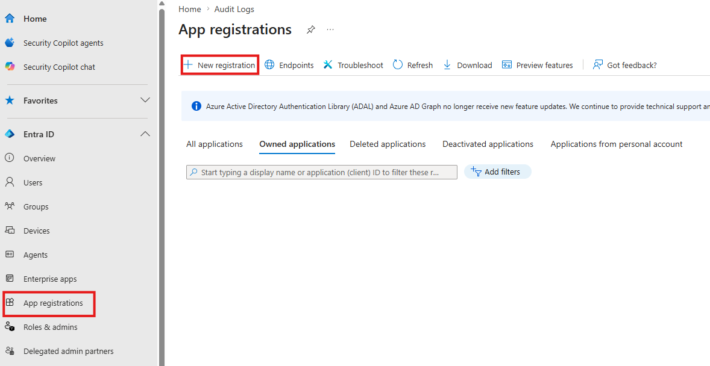
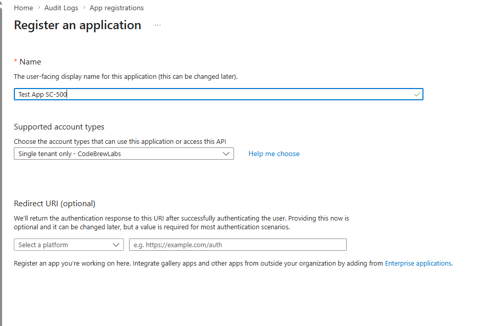
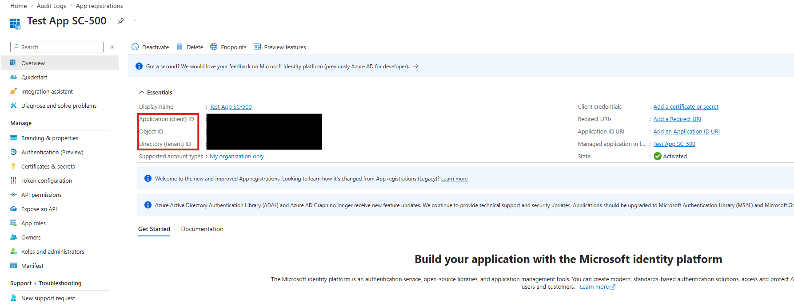
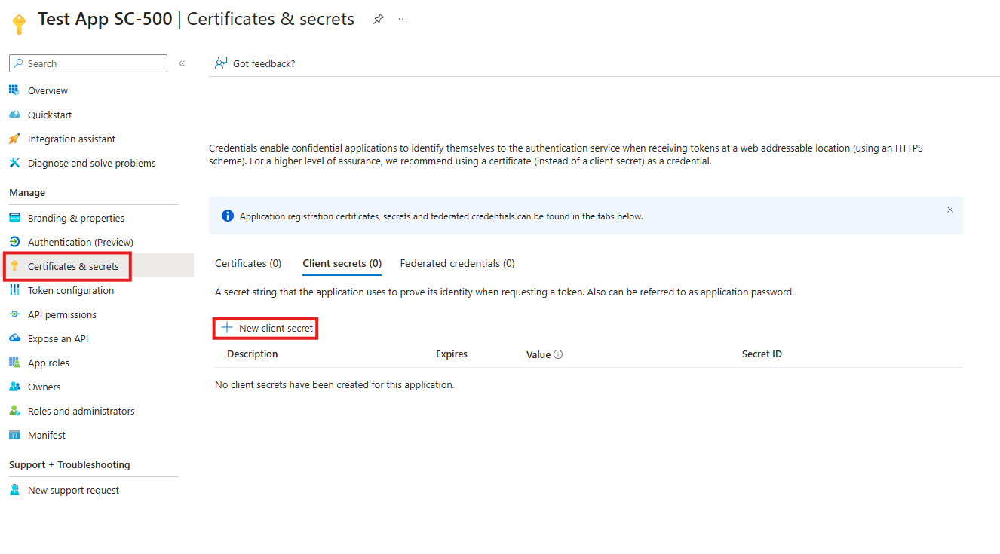
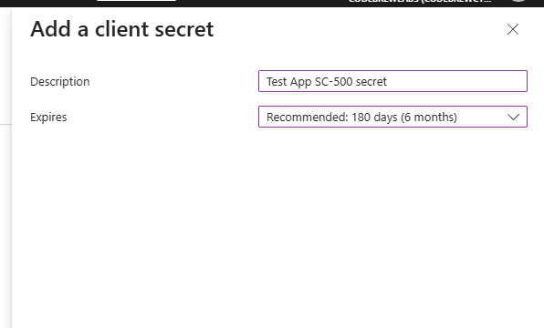
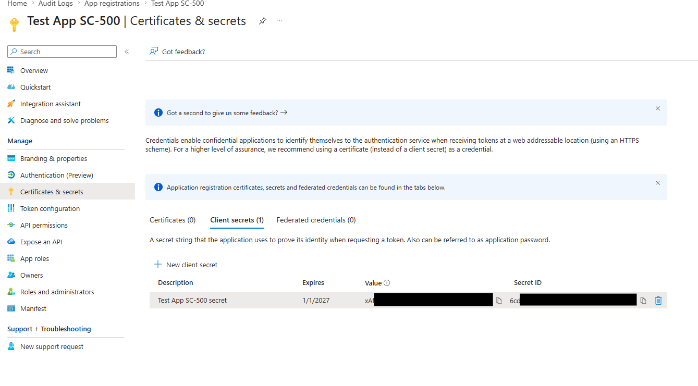
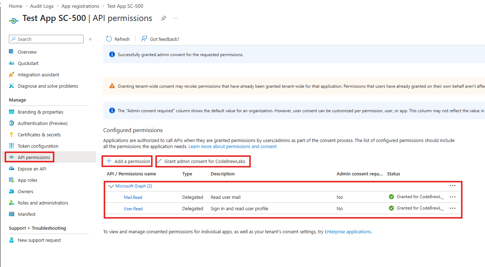
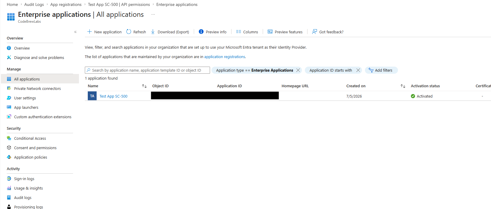
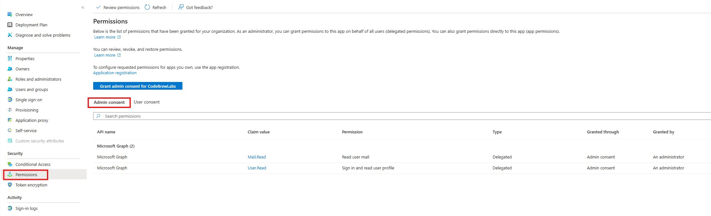

+++
title = "Entra ID App Registration + Admin Consent"
date = 2026-07-05T21:30:00-04:00
draft = false
description = "Register an Entra ID application, issue a client secret, grant tenant-wide admin consent, and trace the grant to the service principal."
tags = ["azure", "entra-id", "identity", "sc-500"]
categories = ["labs"]
aliases = ["/writeups/labs/app-registration-admin-consent/"]
+++

Part of my SC-500 study series: hands-on labs in a test tenant, one concept at a time.

**Goal:** Walk through the full application identity lifecycle in Microsoft Entra ID. Register an app, give it a credential, request API permissions, and grant tenant-wide admin consent. Then look at the same app from the Enterprise applications side to see where the consent actually landed.

## Why this matters

Every application that signs in to Entra ID or calls Microsoft Graph has two objects behind it:

- The **application object** (under App registrations) is the global blueprint: name, credentials, and the permissions the app *requests*.
- The **service principal** (under Enterprise applications) is the local instance of that app in your tenant: what has actually been *granted*, and to whom.

Consent is the bridge between the two. A user can consent only for themselves, and only to low-risk permissions depending on tenant settings. An admin can consent on behalf of the entire tenant. In this lab you'll perform an admin consent grant and then verify it landed on the service principal.

## Prerequisites

- An Entra ID tenant you can experiment in (a free/dev tenant is fine)
- An account with a role that can register apps and grant admin consent (Global Administrator or Privileged Role Administrator in a lab tenant)

## Step 1 - Register the application

Navigate to **Entra ID > App registrations** and click **+ New registration**.

Fill out the registration form:

- **Name:** `Test App SC-500` (this is just a display name and can be changed later)
- **Supported account types:** Single tenant only. Only identities in your tenant can use this app.
- **Redirect URI:** leave blank. We aren't building a real sign-in flow, so no reply URL is needed.

Click **Register**.

## Step 2 - Explore the application object

You land on the app's **Overview** blade. Take note of two values in the Essentials section:

- **Application (client) ID**: the identifier your code would present when requesting tokens
- **Directory (tenant) ID**: the tenant the app authenticates against

Also note that the **Object ID** here is the ID of the application object. Later you'll see the service principal has a different Object ID. Same app, two objects.

## Step 3 - Create a client secret

An app needs a credential to prove its own identity. Go to **Certificates & secrets**, select the **Client secrets** tab, and click **+ New client secret**.

Give it a description (`Test App SC-500 secret`) and accept the recommended expiry of 180 days. Microsoft recommends certificates over secrets for production; a secret is essentially a password for your app.

After clicking **Add**, the secret's **Value** is displayed one time only. Copy it somewhere safe (a key vault, not a text file on your desktop). Once you leave this blade it can never be retrieved again, only replaced.

## Step 4 - Add API permissions and grant admin consent

Go to **API permissions > + Add a permission > Microsoft Graph > Delegated permissions** and add:

- **Mail.Read**: read the signed-in user's mail
- **User.Read**: sign in and read the user's profile

These are **delegated** permissions: the app acts as the signed-in user, so effective access is the intersection of what the app is granted and what the user can do. The alternative, **application permissions**, lets the app act with no user present. That's a much higher-risk grant and always requires admin consent.

Now click **Grant admin consent for [your tenant]** and confirm. The Status column flips to a green "Granted for [tenant]" on both permissions:

> **What admin consent actually did:** that one click consented on behalf of every user in the tenant. No user will ever see a consent prompt for these permissions in this app. This is why admin consent request workflows and periodic review of consented permissions show up as exam topics: it's a powerful, tenant-wide action.

## Step 5 - Find the service principal under Enterprise applications

Navigate to **Entra ID > Enterprise applications**. Registering the app in Step 1 automatically created a service principal for it in your tenant, and there it is in the list: `Test App SC-500`.

## Step 6 - Verify the consent grant on the service principal

Click into the app and open **Security > Permissions**. Under the **Admin consent** tab you can see exactly what we granted: both Microsoft Graph permissions, Type "Delegated", granted through admin consent by an administrator.

This blade is where you'd audit what an app can actually do in your tenant, and where you can review or revoke permissions later.

## Cleanup

Delete the app registration (**App registrations > Test App SC-500 > Delete**). This also removes the service principal and the consent grants.

## Key takeaways

- App registration creates two objects: the application object (blueprint) and the service principal (tenant-local instance). Permissions are requested on the former and granted on the latter.
- Client secret values are shown once. There is no retrieve-later, so plan secret storage (Key Vault) and rotation up front.
- Delegated vs application permissions: delegated acts as the signed-in user; application acts as the app itself with no user. Know which one a scenario calls for.
- Admin consent is tenant-wide. One click grants for all users, which is why consent governance (who can consent, admin consent request workflow, periodic permission review) is part of the SC-500 identity domain.

## Related labs

- [PIM Eligible Role Activation with Approval]()
- [Conditional Access in Report-Only Mode + What If]()
