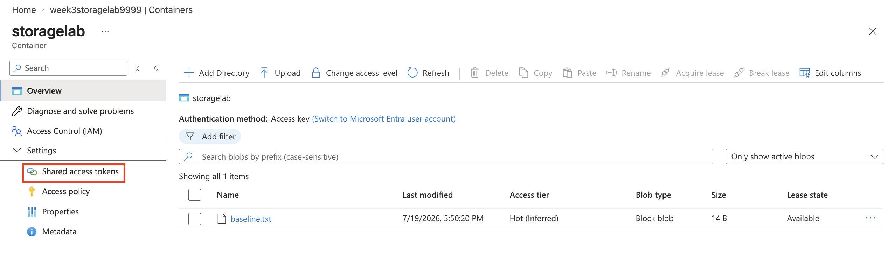
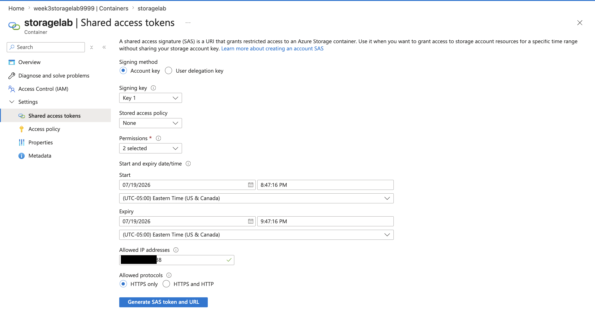
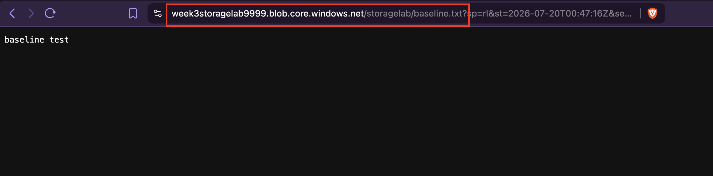
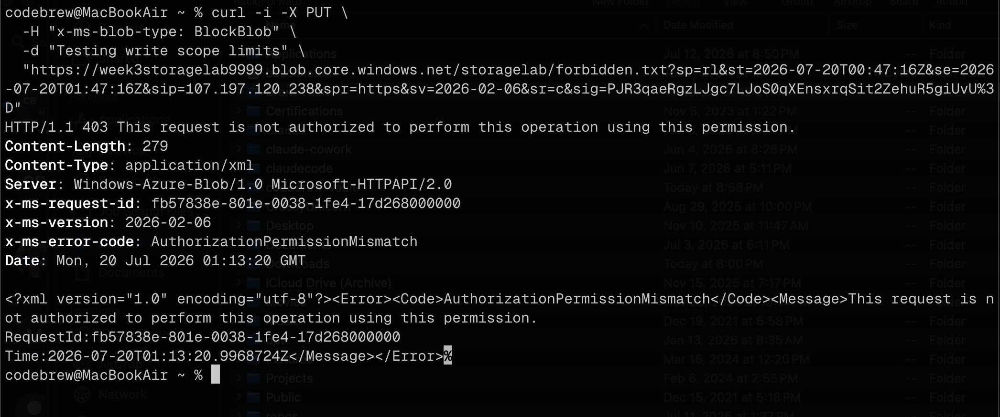
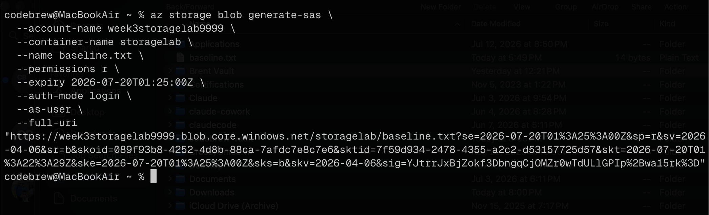
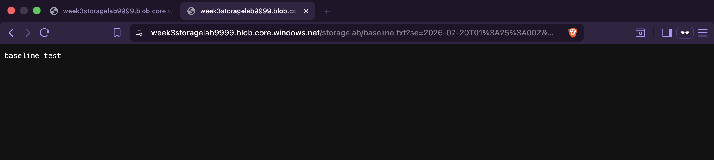
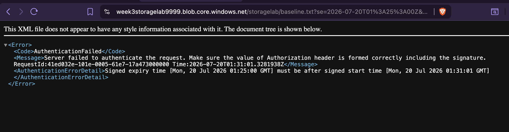
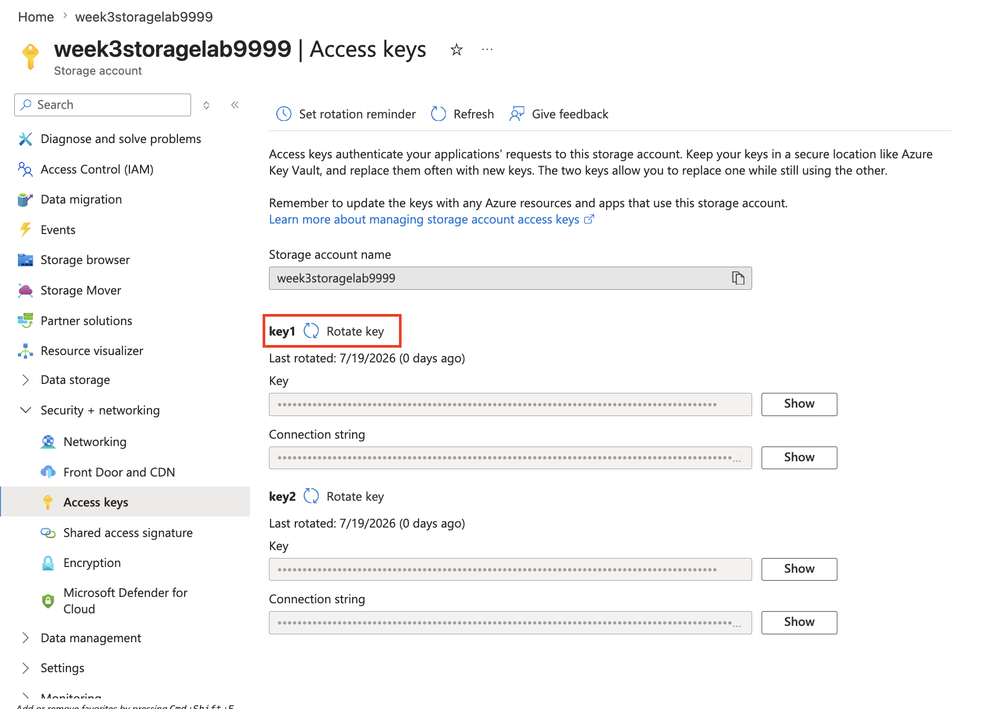
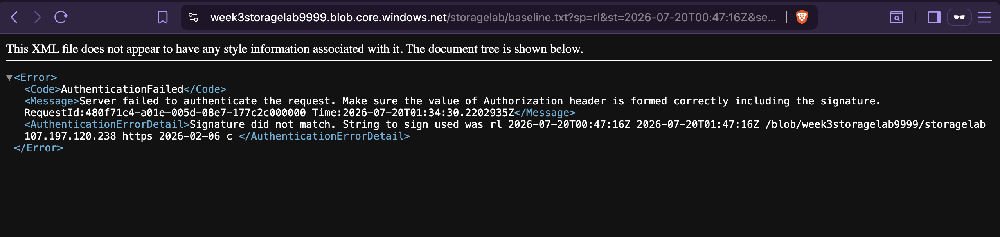

+++
title = "Generate and Use a Scoped SAS Token"
date = 2026-07-21T09:00:00-04:00
draft = false
description = "Generate service and user delegation SAS tokens, then watch scope, expiry, and key rotation each enforce or revoke access from the outside."
tags = ["azure", "storage", "sas", "sc-500"]
categories = ["labs"]
aliases = ["/writeups/labs/generate-scoped-sas-token/"]
+++

Part of my SC-500 study series: hands-on labs in a test tenant, one concept at a time.

**Goal:** Feel how a SAS delegates, scopes, and expires, and what does (and doesn't) revoke one.

## Why this matters

A SAS is a bearer token: nothing about *who you are* travels with it, only what it's scoped to and until when. That's precisely its risk profile, and it's the thing this lab is built to make visceral rather than theoretical.

## Prerequisites

- Builds directly on [Lock Down a Storage Account End-to-End](): same storage account, with public access re-opened to your IP for the tests below

## Step 1 - Generate a service SAS

Upload a test blob, then generate a **service SAS** on the container: read-only, 1-hour expiry, scoped to your IP (portal: container -> Shared access tokens).




## Step 2 - Use it with no login at all

Use the SAS URL from a different tool/machine than the one you're signed into. A `curl` request works with no authentication beyond the token itself:



## Step 3 - Confirm scope: try a write, expect 403

Attempt a write using the same read-only token:



Rejected: the permission scope baked into the token is enforced regardless of who's holding it.

## Step 4 - Generate a user delegation SAS via CLI

```bash
az storage blob generate-sas \
  --account-name week3storagelab9999 \
  --container-name storagelab \
  --name test.txt \
  --permissions r \
  --expiry 2026-07-20T01:25:00Z \
  --auth-mode login \
  --as-user \
  --full-uri
```



No account key is involved: the token is signed with Entra ID credentials via the delegation key instead. The account used to generate it needs read access to blob storage (e.g. **Storage Blob Data Reader**):



## Step 5 - Watch expiration kill it

Wait out (or force with a short expiry) the token's expiration, then hit the same URL again:



Same URL, now dead: expiration is enforced server-side regardless of whether the client remembers it expired.

## Step 6 - Rotate `key1` and test revocation

Rotate the account's `key1`, then re-test whether the original service SAS from Step 1 (signed with an account key) still works:




Rotating the key that signed a service SAS invalidates it immediately: that's the blunt-force revocation option for an account-key-signed token, versus a user delegation SAS which instead dies when the delegation key or the user's own permission is revoked.

## Step 7 - Teardown

```bash
az group delete --name rg-week3-lab --yes --no-wait
```

## Key takeaways

- A SAS carries no identity: anyone holding the string can use it exactly as scoped, which is why "who leaked it" matters more than "who's using it."
- Scope (permissions, expiry, IP restriction) is enforced by Azure regardless of which client presents the token.
- Two different revocation mechanisms exist depending on how the SAS was signed: rotate the account key to kill *every* key-signed SAS at once (blunt), or revoke the user's Entra permission / delegation key for a user delegation SAS (targeted).
- User delegation SAS is the exam's preferred type specifically because it never touches an account key: its blast radius on revocation is scoped to one user, not the whole account.

## Related labs

- [Lock Down a Storage Account End-to-End]() is this lab's environment
- Azure SQL Database Hardening applies the same lockdown thinking to a managed database
