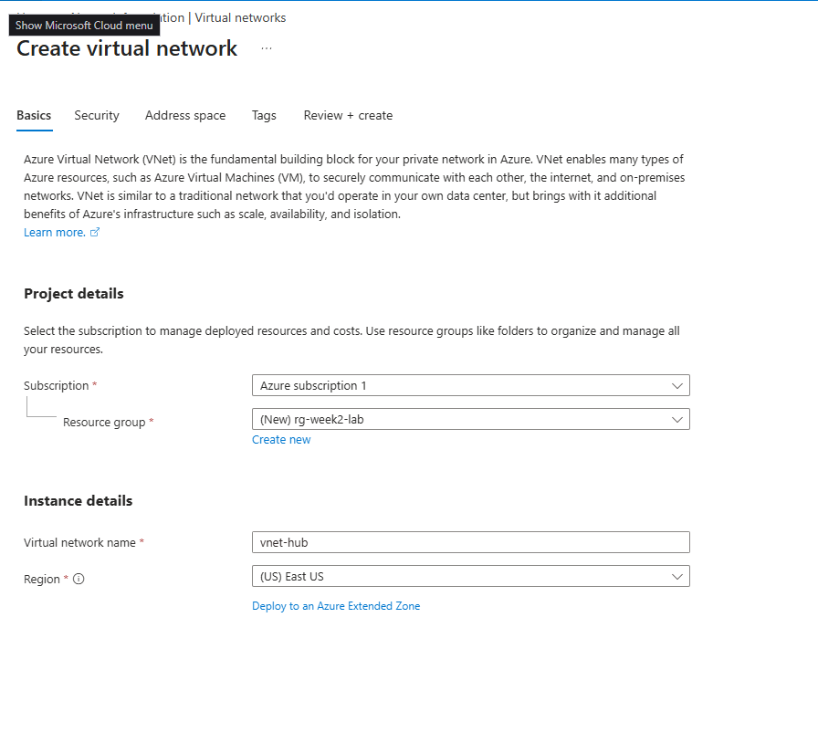
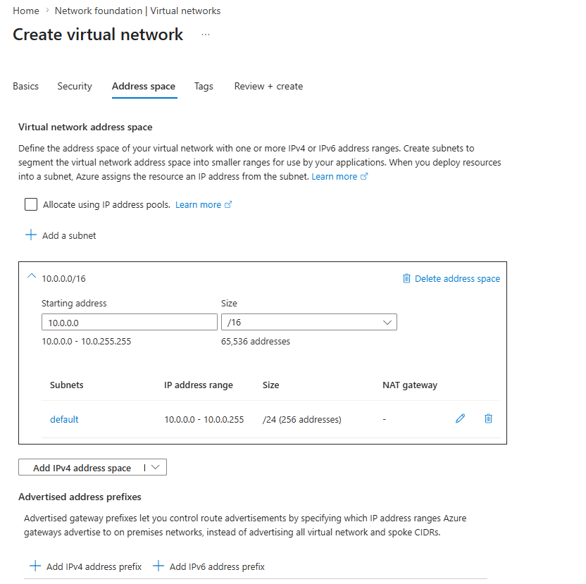
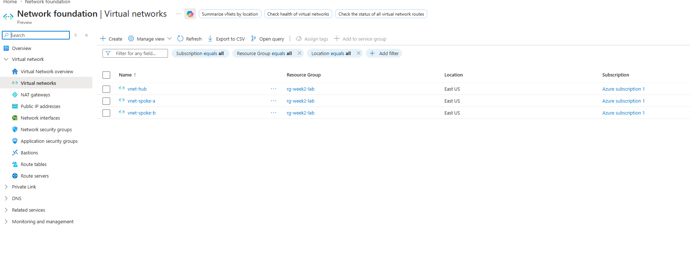
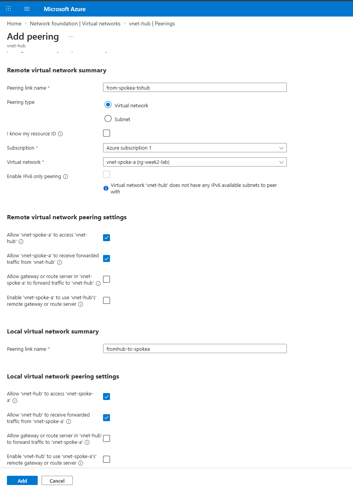
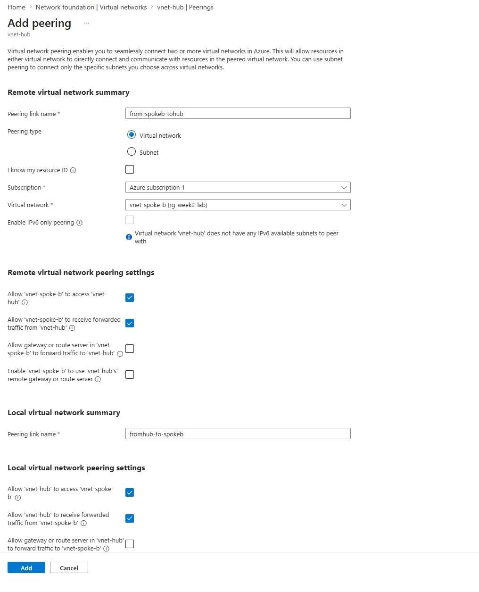
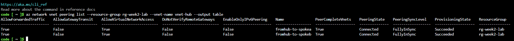
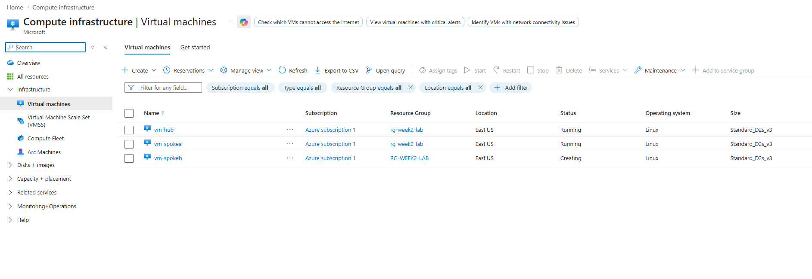
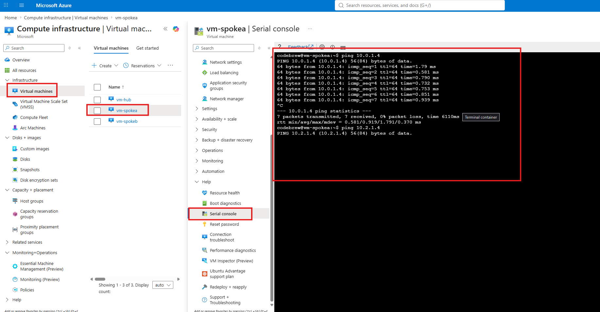
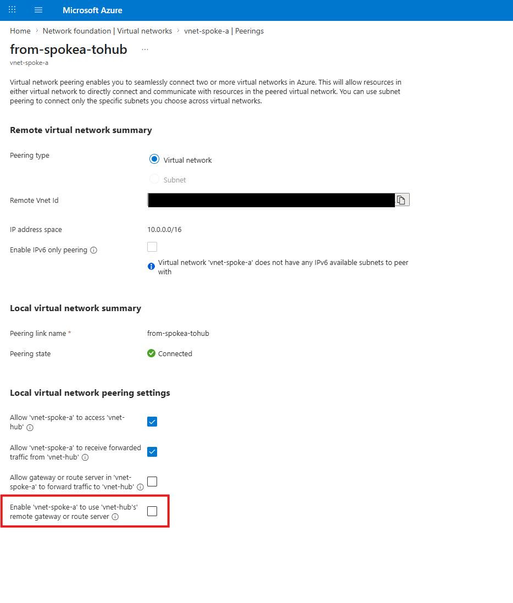

+++
title = "Hub-Spoke Topology with VNet Peering"
date = 2026-07-11T19:30:00-04:00
draft = false
description = "Build a hub-and-spoke topology with VNet peering and verify non-transitivity with live pings between spoke VMs."
tags = ["azure", "networking", "vnet-peering", "sc-500"]
categories = ["labs"]
aliases = ["/writeups/labs/hub-spoke-vnet-peering/"]
+++

Part of my SC-500 study series: hands-on labs in a test tenant, one concept at a time.

**Goal:** Build the classic hub-and-spoke network topology (one hub VNet peered to two spoke VNets), then verify with live pings that VNet peering is **non-transitive**: spokes can reach the hub, but not each other.

## Why this matters

Hub-spoke is the topology nearly every Azure network security scenario assumes: shared services (firewall, VPN/ExpressRoute gateway, DNS) live in the hub, workloads live in spokes, and the spokes are isolated from each other by default. That isolation comes from one fact:

> Peering is a 1:1, non-transitive relationship. A peered with B, and B peered with C, does not give A a path to C.

If spokes need to talk, traffic has to be routed through something in the hub (an Azure Firewall or NVA, via UDRs), which also happens to be where you want the inspection point. This lab builds the topology; later labs add the NSGs and firewall on top of it.

## Prerequisites

- An Azure subscription
- Rights to create VNets and VMs (Owner/Contributor on a subscription or resource group)
- Az CLI (optional, for the verification step; Cloud Shell works fine)

## Step 1 - Create three VNets

Create one resource group (`rg-week2-lab`) and three VNets in the same region so everything is easy to manage and cheap to tear down:

| VNet | Address space | Subnet |
|---|---|---|
| `vnet-hub` | `10.0.0.0/16` | `default` |
| `vnet-spoke-a` | `10.1.0.0/16` | `default` |
| `vnet-spoke-b` | `10.2.0.0/16` | `default` |

On the Basics tab, create the new resource group and name the VNet:



On the **Address space** tab, set the range. The address spaces must not overlap; peering between overlapping VNets is refused outright.



Repeat for both spokes. When done, all three VNets sit in `rg-week2-lab`:



## Step 2 - Peer hub to spoke-a and hub to spoke-b (but NOT spoke to spoke)

From `vnet-hub` go to **Settings > Peerings > + Add**. One "Add peering" form creates both directions at once, and the naming makes more sense once you notice the form has two halves:

- **Remote virtual network summary**: the link created on the spoke, pointing at the hub: `from-spokea-tohub`
- **Local virtual network summary**: the link created on the hub, pointing at the spoke: `fromhub-to-spokea`

Select `vnet-spoke-a` as the remote network and leave the default settings (both sides allow access; gateway options unchecked).



Repeat for spoke-b (`from-spokeb-tohub` / `fromhub-to-spokeb`):



Deliberately do not peer the spokes to each other. That missing link is what we're going to test in Step 4.

> **Both directions must exist.** A peering is only "Connected" when both ends are configured. The portal's single form handles this for you, but the CLI/ARM route requires creating each direction explicitly, and a half-configured peering sits in "Initiated" state, passing no traffic.

### Verify from the CLI

```bash
az network vnet peering list \
  --resource-group rg-week2-lab \
  --vnet-name vnet-hub \
  --output table
```

Both hub-side peerings show **PeeringState: Connected** and **FullyInSync**:



Worth reading the columns: `AllowVirtualNetworkAccess: True` (traffic allowed), `AllowGatewayTransit: False` (no gateway sharing; see Step 5).

## Step 3 - Drop a test VM into each VNet

Deploy one small Linux VM into each VNet's default subnet: `vm-hub`, `vm-spokea`, `vm-spokeb`. A burstable size like `Standard_B1s` is plenty.

No public IPs needed. We'll use the Serial console for access, which works entirely out-of-band. In production you'd use SSH or Bastion; serial console is the quick lab tool.



## Step 4 - Test non-transitivity with ping

Open **vm-spokea > Help > Serial console**, log in, and ping the other two VMs by their private IPs:

- Ping the hub VM: replies come back immediately. Spoke-a to hub peering works.
- Ping the spoke-b VM (10.2.x.x): the ping just hangs. No route exists. Spoke-a's peering gets it to the hub, but the hub will not forward it on to spoke-b.



That hanging ping is non-transitive peering observed live. Two peerings don't chain into a path. This is why hub-spoke gives you spoke isolation by default, and why spoke-to-spoke traffic in real designs is forced through a hub firewall with user-defined routes.

## Step 5 - Locate the gateway transit settings

On the peering (for example `from-spokea-tohub` on `vnet-spoke-a`), find the two gateway-related checkboxes:

- **Allow gateway or route server in 'vnet-hub' to forward traffic** (Allow gateway transit, set on the hub side)
- **Enable 'vnet-spoke-a' to use 'vnet-hub's' remote gateway or route server** (Use remote gateway, set on the spoke side)



Leave them unchecked since we have no gateway deployed, but know what they do: they let spokes share the hub's VPN/ExpressRoute gateway instead of each needing their own. The two settings pair up across the peering (hub offers transit, spoke consumes it), and this is the standard way on-premises connectivity reaches spokes in a hub-spoke design.

## Wrap-up - leave it running

Don't tear this down if you're following the series. The NSG lab reuses this environment. Just deallocate the VMs overnight to stop compute charges:

```bash
az vm deallocate -g rg-week2-lab -n vm-hub
az vm deallocate -g rg-week2-lab -n vm-spokea
az vm deallocate -g rg-week2-lab -n vm-spokeb
```

## Key takeaways

- Peering is non-transitive. Hub-A plus Hub-B gives A no path to B, verified here with a hanging ping rather than just a doc page.
- Every peering is two directed links, and both must exist for the state to be "Connected". Pick a naming convention that encodes direction.
- Address spaces must not overlap for peering to be possible. Plan CIDR ranges up front.
- Gateway transit / Use remote gateway let spokes share the hub's gateway, which is how on-prem connectivity works in hub-spoke.
- Spoke-to-spoke traffic in real designs goes through a hub firewall/NVA with UDRs: isolation by default, inspection by design.

## Related labs

- [NSG Priority Ordering + Network Watcher Verification]() builds directly on this environment
- [Custom RBAC Role + Azure Policy + Resource Lock]()
