+++
title = "Lock Down a Storage Account End-to-End"
date = 2026-07-20T22:00:00-04:00
draft = false
description = "Walk a storage account from public-by-default to private-endpoint-only, proving each network state live: firewall rules, a private endpoint, and split-horizon DNS observed directly."
tags = ["azure", "storage", "private-endpoint", "firewall", "sc-500"]
categories = ["labs"]
aliases = ["/writeups/labs/lock-down-storage-account/"]
+++

Part of my SC-500 study series: hands-on labs in a test tenant, one concept at a time.

**Goal:** Walk a storage account from "public by default" to "private-endpoint only," proving each state transition live rather than just reading about it.

## Why this matters

A storage account's exposure is controlled by two independent layers: network (firewall rules, private endpoints) and auth (keys, SAS, Entra RBAC). This lab isolates the network layer: each step below narrows *where* the account can be reached from, while auth stays constant, so you can see exactly which layer rejects each blocked request.

## Prerequisites

- A storage account, a small VNet with one subnet, and a test VM inside it (the "inside" observer)
- A blob container to test against

## Step 1 - Provision and seed test data

Create the storage account, VNet, subnet, and test VM:

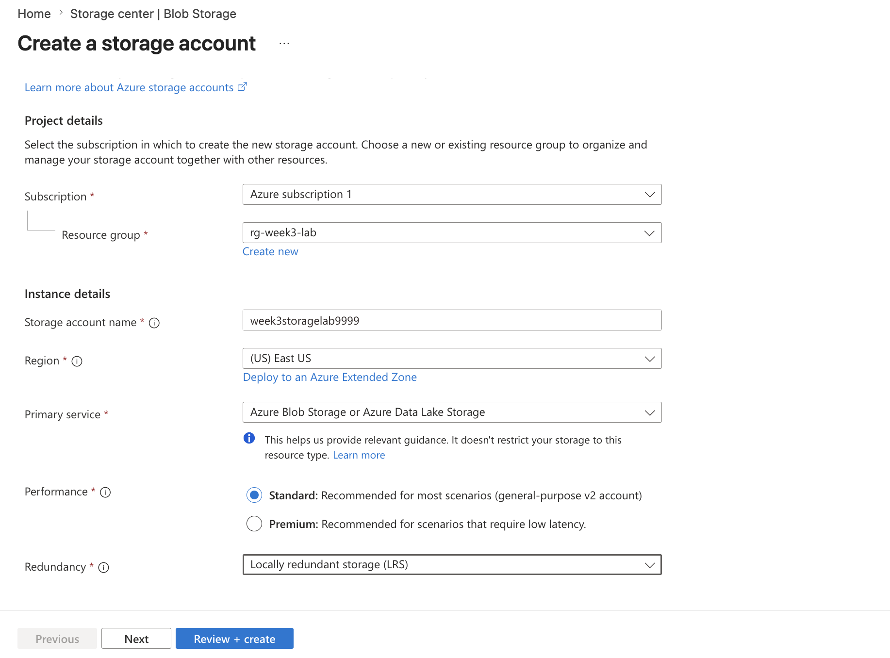
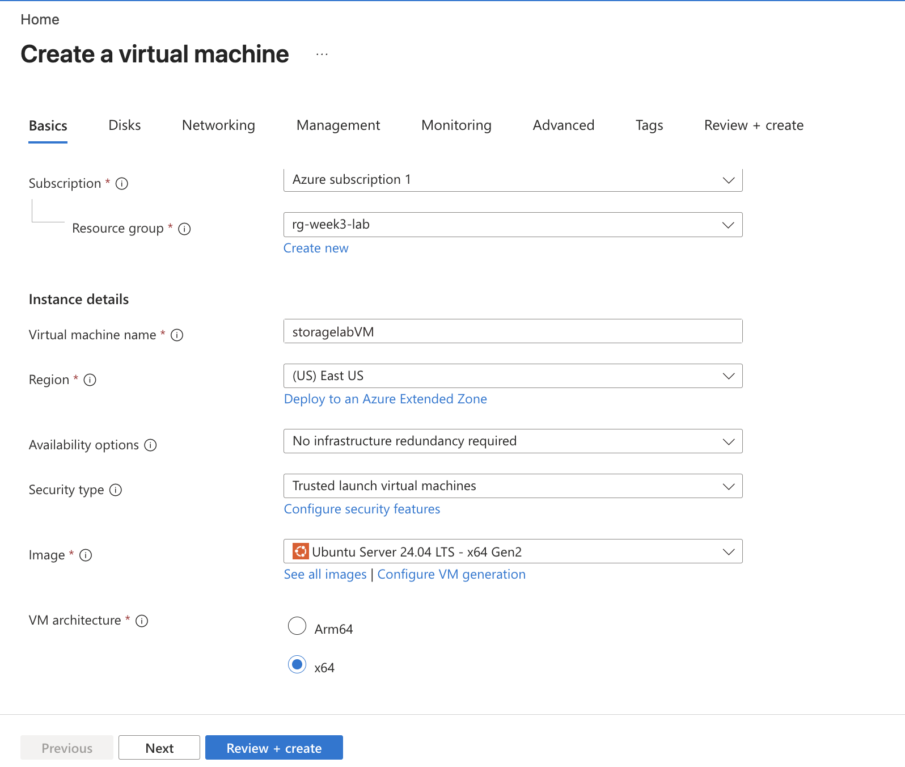
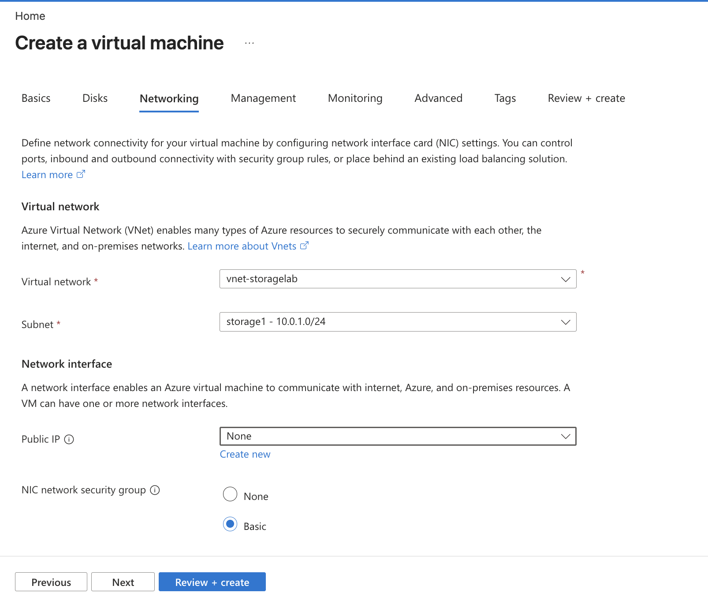
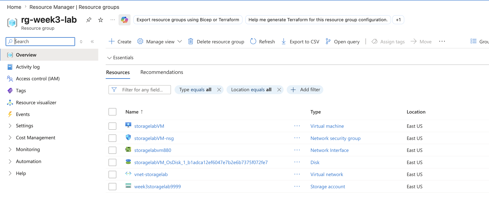

Create a blob container named `storagelab`:

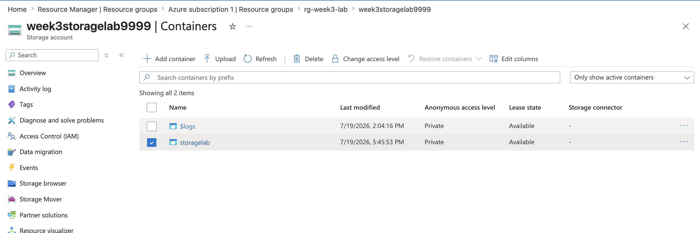

Upload a test file into it:

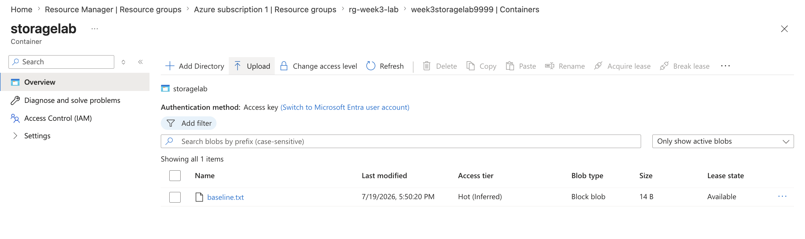

## Step 2 - Baseline: confirm public access works

From your laptop, confirm the blob endpoint answers publicly:

```bash
nslookup mystorage.blob.core.windows.net
```

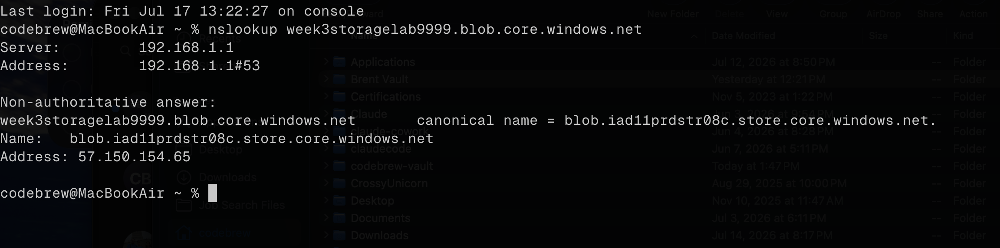

`nslookup` resolves to the public endpoint. Then check access via CLI, logged in as an account with the right permissions:

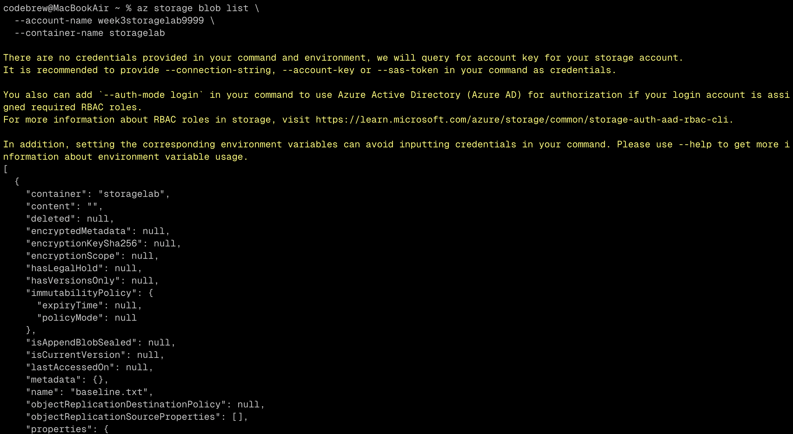

## Step 3 - Firewall rules: deny by default, allow one IP

Set the storage firewall's default action to **Deny**, and add an IP rule scoped to your own public IP only:

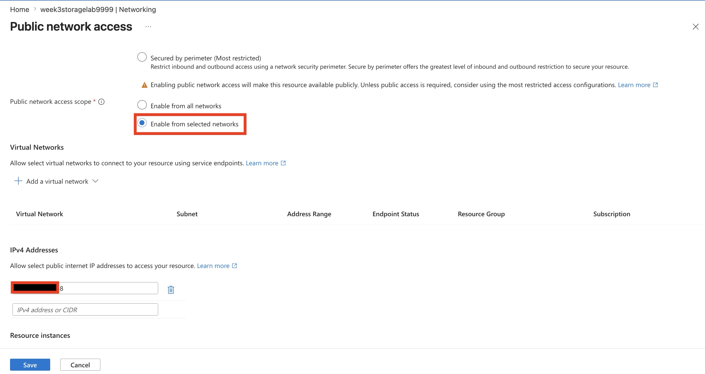
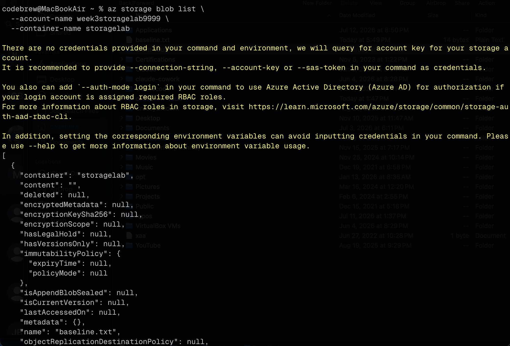

From your own computer the public endpoint still resolves and works: your IP is allowed. Log into the test VM and try the same request with `curl`:

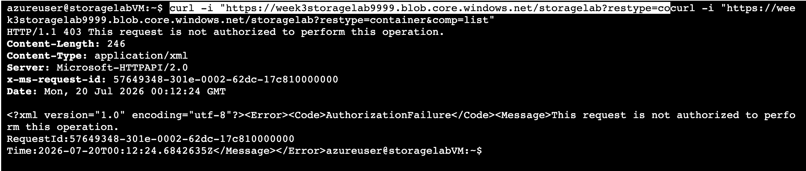

As expected, the request is blocked. The VM's outbound path isn't in the allow-list, even though it's "inside" Azure.

## Step 4 - Allow trusted Microsoft services

Enabled the *Allow trusted Microsoft services* exception (not screenshotted). This is what keeps things like Azure Backup and Defender working after the firewall locks down, without opening the account to the public internet generally.

## Step 5 - Add a private endpoint

Create a private endpoint for the `blob` sub-resource into the VNet's subnet, letting the portal create and link the `privatelink.blob.core.windows.net` private DNS zone automatically:

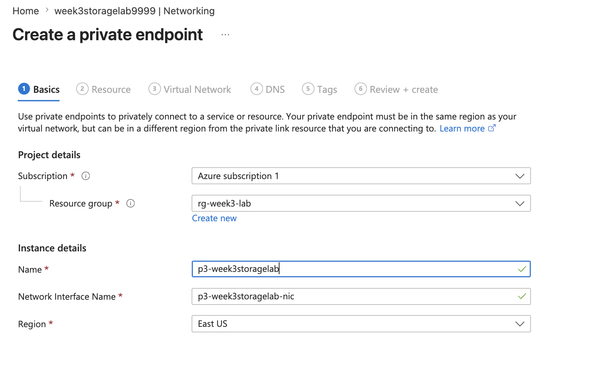
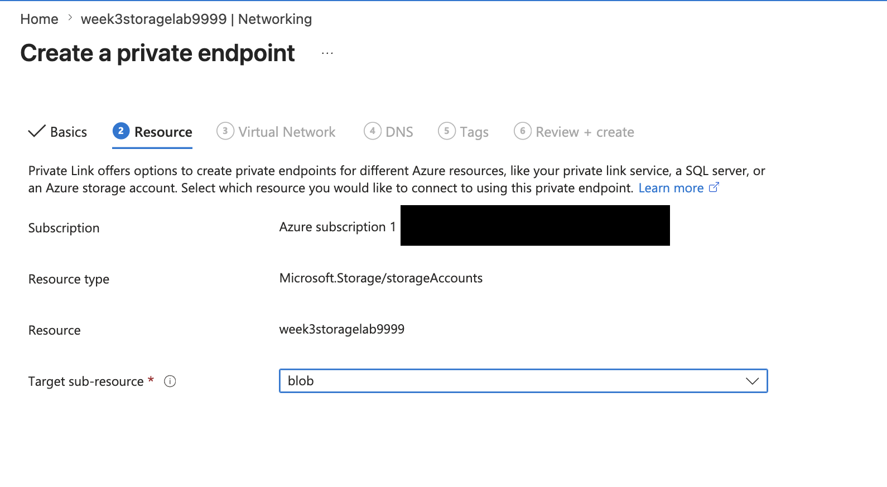
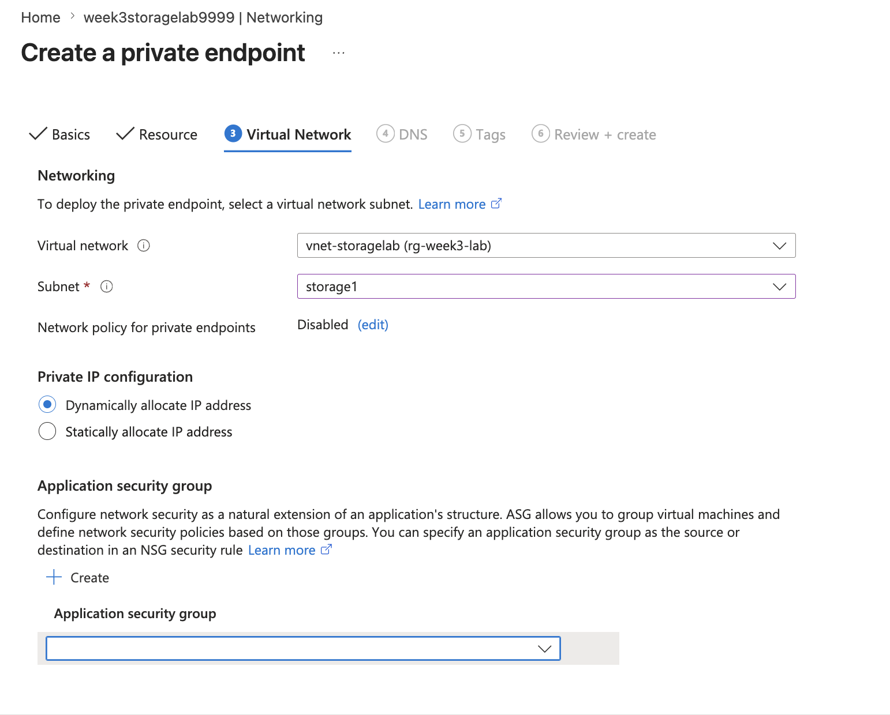
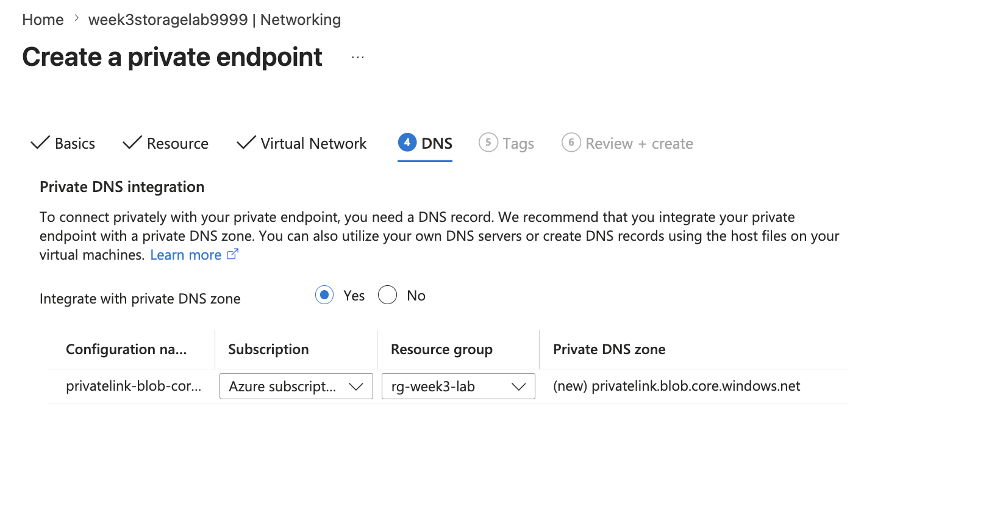

## Step 6 - The money observation: split-horizon DNS, live

From the test VM, `nslookup mystorage.blob.core.windows.net` now returns the **private IP**:

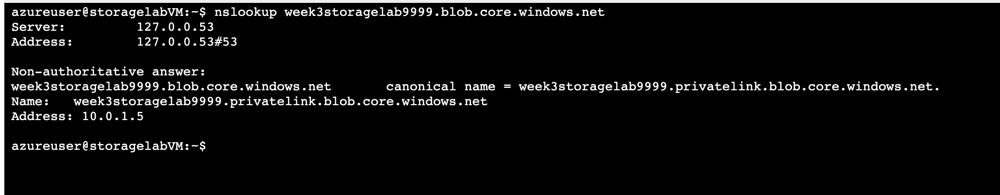

From the laptop, the same command still resolves to the public path:

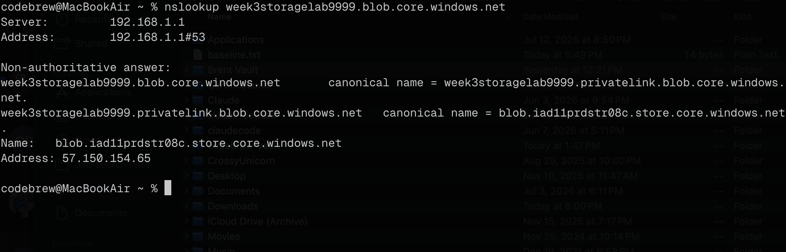

Same hostname, two different answers depending on which network asked: split-horizon DNS observed directly rather than taken on faith from the docs.

## Step 7 - Full lockdown: disable public access entirely

Set **public network access = Disabled**:

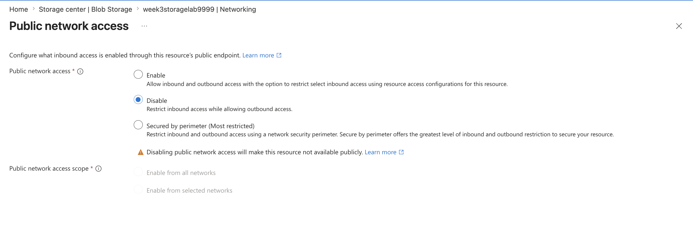
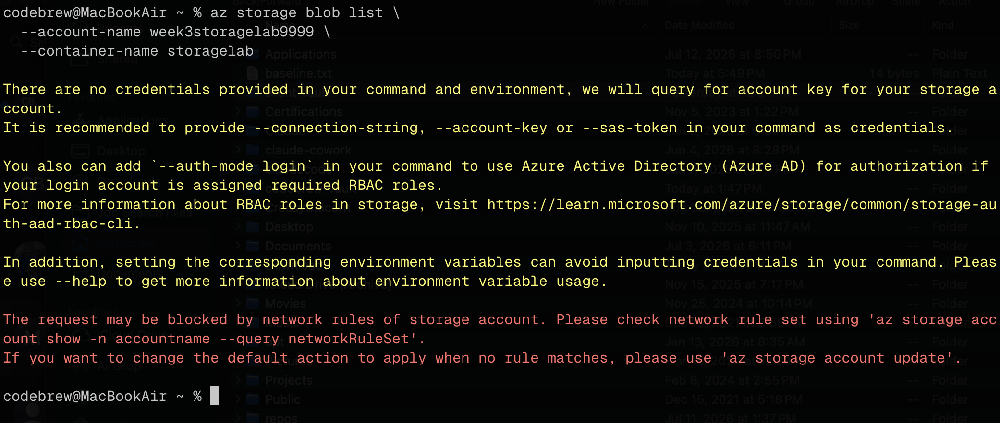

The laptop can no longer list the container at all: public access is gone. The VM, reaching the account through its private IP, is unaffected.

## Step 8 - Re-open a public path for the next lab

Re-enabled public access from selected networks (just my IP) to leave a public path available for [Generate and Use a Scoped SAS Token](), which needs one.

## Key takeaways

- Network rules and auth are independent layers. This lab held auth constant and only moved the network dial, which is why the VM's failures and the laptop's failures were both clean "network layer" rejections, not auth errors.
- A private endpoint doesn't just add a path, it changes what a hostname *resolves to*, and only for clients inside the linked VNet. That's the split-horizon behavior in Step 6.
- Locking `defaultAction=Deny` breaks anything not explicitly allowed, including your own Azure-side resources (the test VM) unless they're on an allowed path. Worth remembering before doing this against something in production.
- Full lockdown (`public network access = Disabled`) is a strictly stronger state than firewall rules with `Deny` plus an IP allow-list: it removes the public endpoint's reachability outright, not just gates it.

## Related labs

- [Generate and Use a Scoped SAS Token]() reuses this environment
- Azure SQL Database Hardening applies the same network-lockdown pattern to a different data service
