+++
title = "PIM Eligible Role Activation with Approval"
date = 2026-07-05T20:30:00-04:00
draft = false
description = "Configure a PIM eligible assignment with approval, activate a role just-in-time, and follow the full trail through the audit logs."
tags = ["azure", "entra-id", "pim", "identity-governance", "sc-500"]
categories = ["labs"]
aliases = ["/writeups/labs/pim-eligible-role-activation/"]
+++

Part of my SC-500 study series: hands-on labs in a test tenant, one concept at a time.

**Goal:** Run the complete Privileged Identity Management (PIM) just-in-time access loop end to end. Make a user **eligible** for the Security Reader role, harden the role's activation settings (1-hour max, justification, approval), then activate the role as the user, approve the request as the approver, and verify the whole trail in the audit logs.

## Why this matters

Standing privileged access is one of the biggest identity attack surfaces. A compromised account with a permanent admin role gives the attacker that role permanently too. PIM replaces standing access with just-in-time elevation:

- **Eligible assignment**: the user can have the role, but doesn't hold it right now. Activation is a deliberate, logged, time-boxed act.
- **Active assignment**: the user holds the role continuously (what PIM tries to minimize).

The activation gates you'll configure here (MFA/justification/ticket/approval, maximum duration) come up regularly on the SC-500. PIM requires **Entra ID P2** licensing.

## Prerequisites

- Entra ID **P2** (or a trial with it)
- A test user (this lab: `Test User`) and a second account to act as approver
- Privileged Role Administrator or Global Administrator rights for the setup steps

## Part 1 - Assign an eligible role

### 1.1 Open PIM and add an assignment

Go to **Entra admin center > ID Governance > Privileged Identity Management > Microsoft Entra roles > Assignments** and click **+ Add assignments**. Notice the three tabs: Eligible, Active, and Expired assignments. That's the PIM lifecycle in one view.

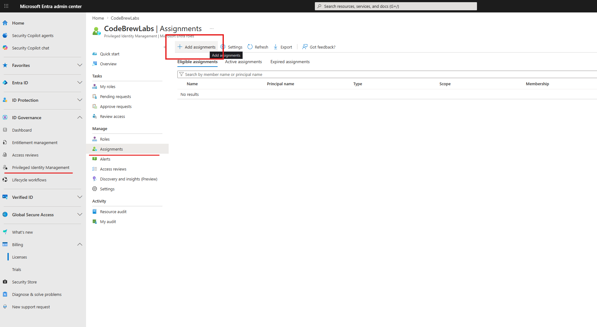

### 1.2 Choose the role and member

On the **Membership** tab:

- **Select role:** `Security Reader`, a deliberately low-risk role for lab purposes
- **Scope type:** Directory
- **Select member(s):** the **Test User**

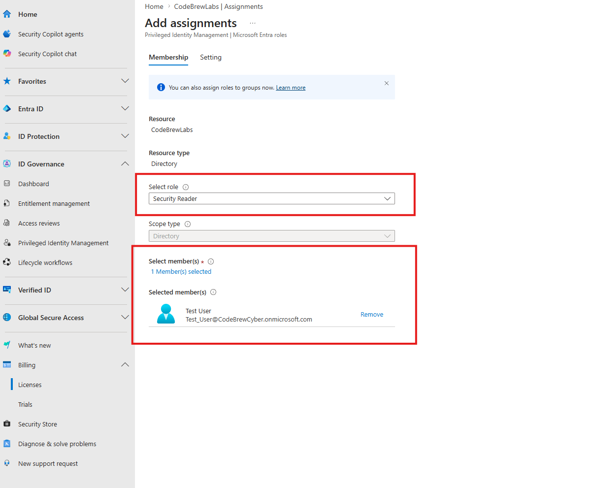

### 1.3 Make it Eligible, not Active

On the **Setting** tab, choose **Assignment type: Eligible** and set an assignment window (here, one day). This window bounds eligibility itself and is separate from the activation duration we'll configure next. Click **Assign**.

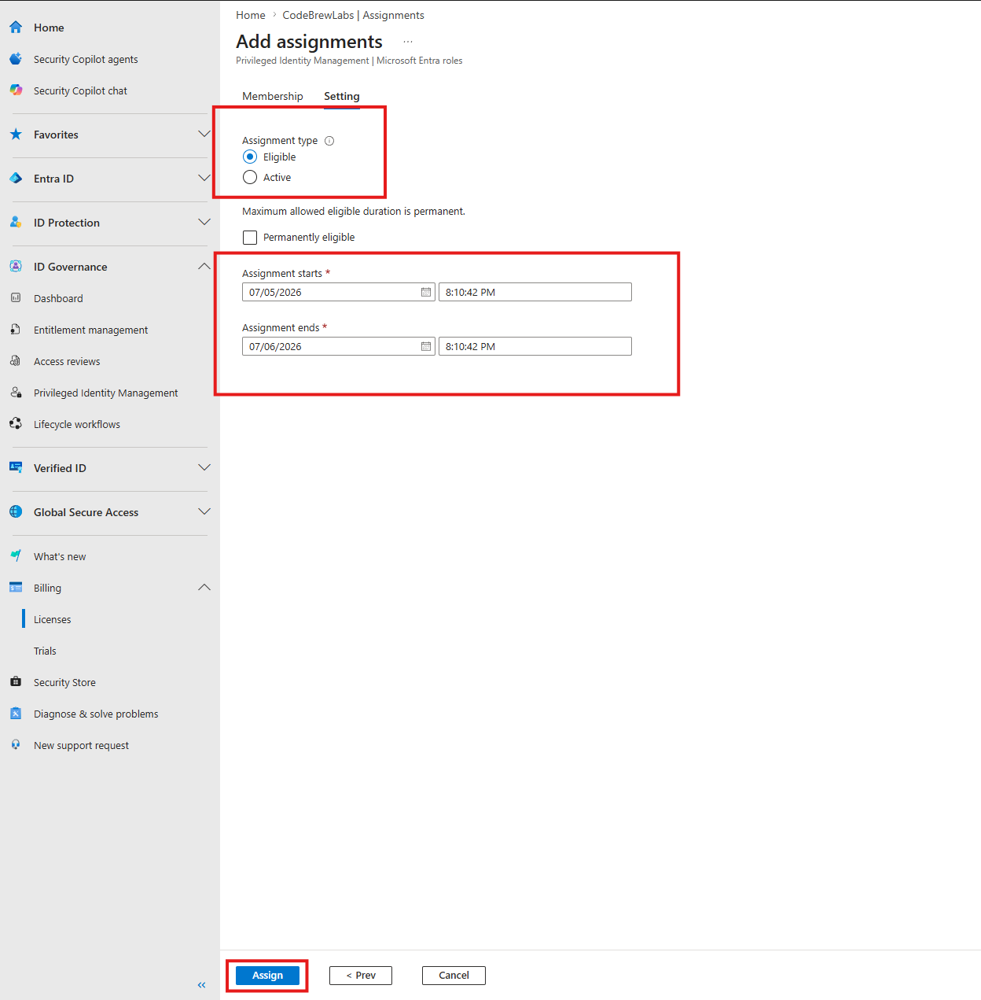

> **Two different clocks.** Assignment start/end controls how long the user stays eligible. Activation maximum duration controls how long each individual activation lasts. Confusing these is a classic exam trap.

## Part 2 - Harden the role's activation settings

Role settings are per-role policies that govern what activation requires. Go to **PIM > Microsoft Entra roles > Settings** and filter for `security` to find **Security Reader**.

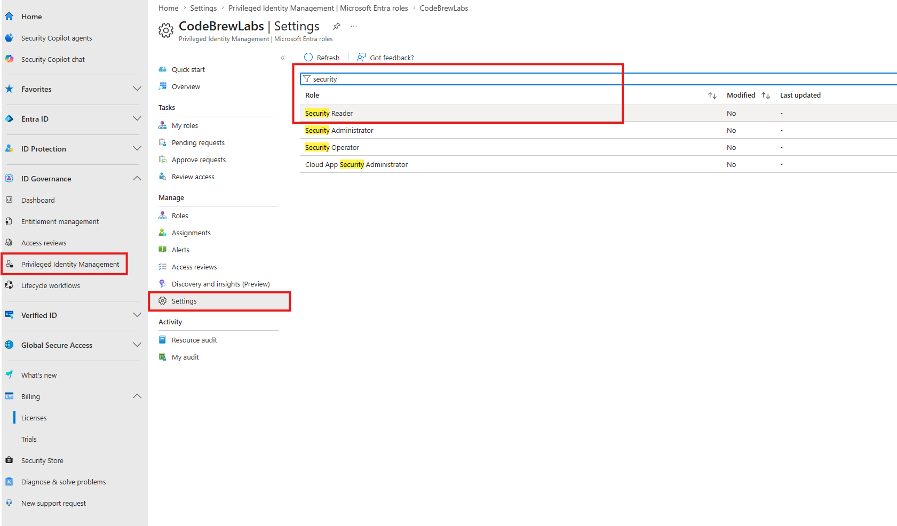

The current defaults are visible on the role setting details page: 8-hour max activation, no approval required. Click **Edit**.

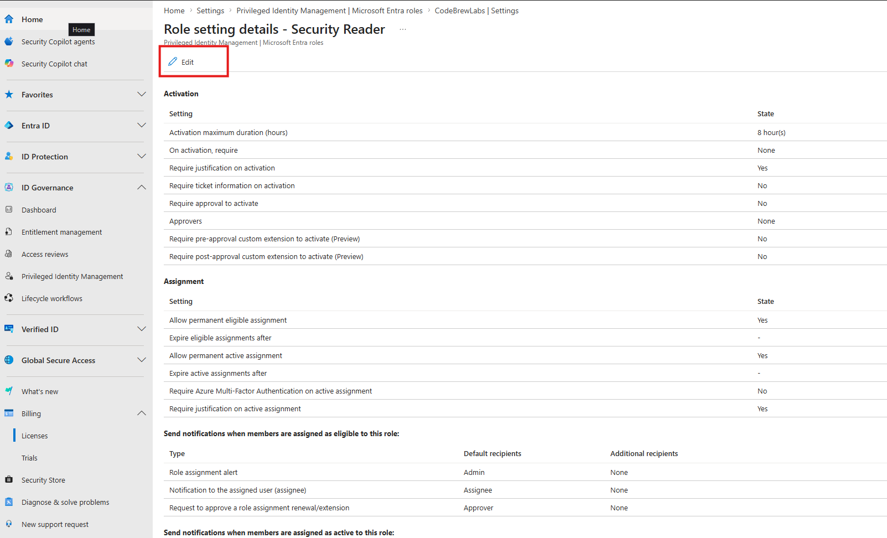

On the **Activation** tab, change three things:

- **Activation maximum duration:** 1 hour
- Check **Require justification on activation**
- Check **Require approval to activate**, and select a specific approver. If no approver is selected, Privileged Role Administrators and Global Administrators become the default approvers.

Click **Update**.

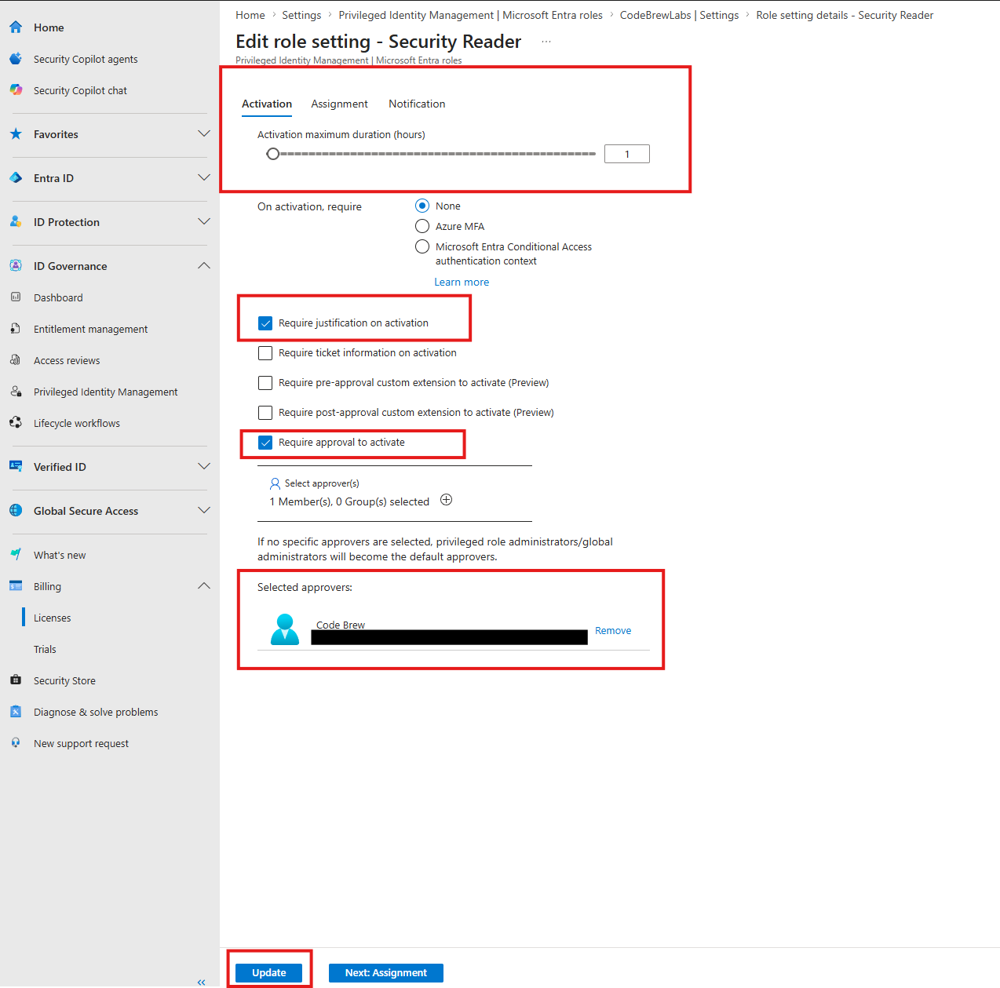

## Part 3 - Activate the role as the test user

### 3.1 Request activation

Sign in as the test user and go to **PIM > My roles > Microsoft Entra roles**. Under **Eligible assignments** sits Security Reader with an **Activate** link. Click it.

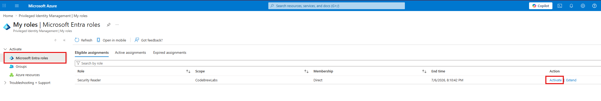

### 3.2 Provide justification

The activation pane enforces exactly what we configured: duration capped at 1 hour, and a mandatory Reason field. Enter a justification and click **Activate**.

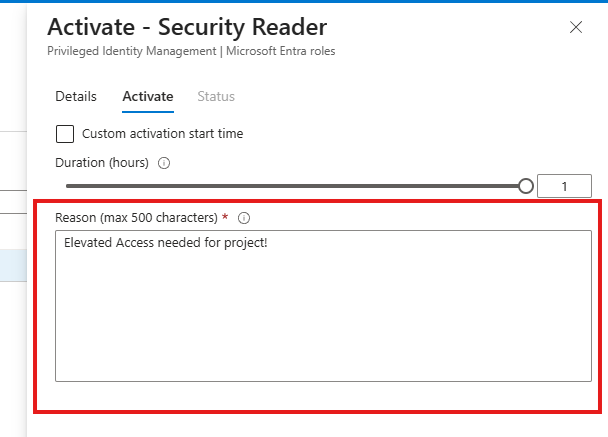

Because approval is required, the request now goes into a pending state. The user does not get the role yet.

## Part 4 - Approve the request

### 4.1 The approver is notified by email

The approver receives an email summarizing the request (who, which role, the justification, the start time) with an **Approve or deny request** button.

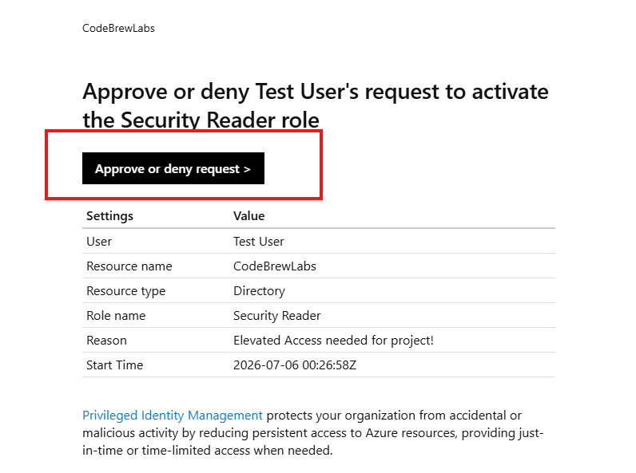

### 4.2 Approve in the portal

The link lands on **PIM > Approve requests**, where the request appears under **Requests for role activations**. Select it, add an approval justification, and **Approve**.

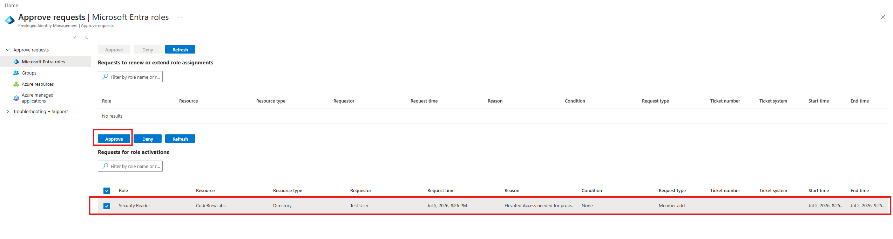

## Part 5 - Verify the elevation

### 5.1 The role is now active on the user

Under **Entra ID > Users > Test User > Assigned roles**, the **Active assignments** tab now shows **Security Reader**: a real role assignment, created by PIM, that will be removed automatically at the end of the activation window.

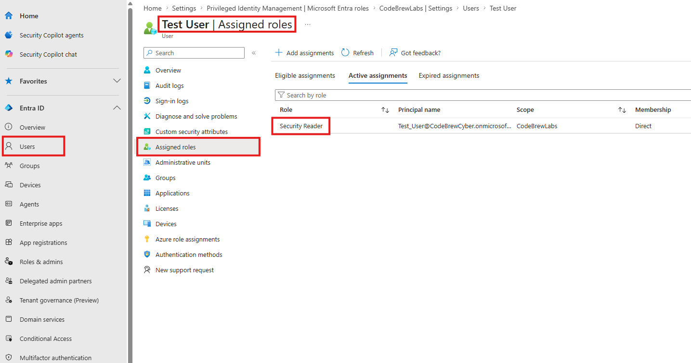

### 5.2 The audit trail

**Audit Logs** capture every step with PIM as the service: the eligible assignment, the role-setting change, the activation request (with the justification as the Status Reason), the approval, and finally "Add member to role". This is the evidence chain an auditor, or an incident responder, would walk through.

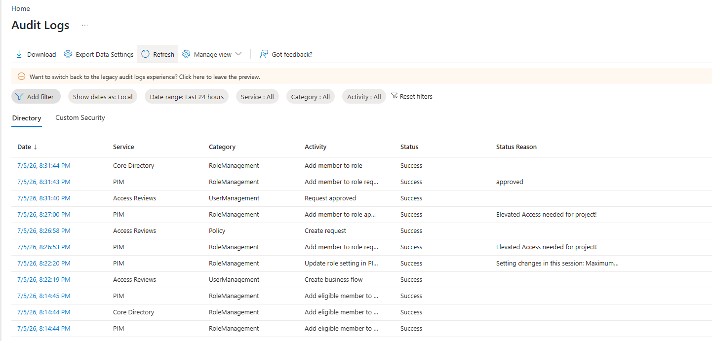

## Part 6 - Deactivate

If the user finishes early, they can end the elevation themselves: **My roles > Active assignments > Deactivate**. Otherwise it expires automatically at the 1-hour mark. The minimum activation duration is 5 minutes.

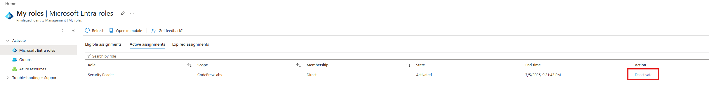

## Cleanup

Remove the eligible assignment (**PIM > Microsoft Entra roles > Assignments**) and optionally reset the Security Reader role settings to defaults.

## Key takeaways

- Eligible and Active are different states. Eligible means "may activate"; active means "holds the role now". PIM's goal is zero standing privileged access.
- Role settings are per-role activation policy: max duration, MFA/justification/ticket requirements, and approval with named approvers.
- Approval inserts a human gate. The requestor holds nothing until an approver signs off, and both sides must justify.
- Everything is logged. PIM writes the full request, approval, assignment, and expiry chain to the audit logs.
- Know the licensing: PIM is an Entra ID P2 feature (Conditional Access is P1).

## Related labs

- [Conditional Access in Report-Only Mode + What If]()
- [Entra ID App Registration + Admin Consent]()
- [Custom RBAC Role + Azure Policy + Resource Lock]()
