+++
title = "Conditional Access in Report-Only Mode + What If"
date = 2026-07-05T21:00:00-04:00
draft = false
description = "Build a location-based Conditional Access block policy, deploy it in report-only mode, and prove the logic with the What If tool."
tags = ["azure", "entra-id", "conditional-access", "sc-500"]
categories = ["writeups"]
+++

Part of my SC-500 study series: hands-on labs in a test tenant, one concept at a time.

**Goal:** Build a location-based Conditional Access policy that blocks sign-ins from outside the United States, deploy it in **Report-only** mode so it can't lock anyone out, and then use the **What If** tool to simulate sign-ins and confirm the policy logic works, all without enforcing anything.

## Why this matters

Conditional Access is the policy engine of Entra ID: it takes signals (who, what app, from where, how risky), applies conditions, and enforces a decision (block, or grant with controls like MFA). Two safety mechanisms make it possible to roll out policies without breaking production sign-ins:

- **Report-only mode**: the policy is evaluated on every real sign-in and the would-be result is logged, but nothing is enforced.
- **What If**: a simulator that evaluates hypothetical sign-in scenarios against your policies before (or after) you turn them on.

The rule of thumb this lab drills in: never go straight to "On" with a new CA policy, especially a Block policy.

## Prerequisites

- Entra ID P1 licensing (required for Conditional Access), included in most trial/dev tenants
- A test user account (this lab uses `Test User`)
- An account with the Conditional Access Administrator role (or Global Administrator in a lab tenant)

## Step 1 - Create a Named Location

Before the policy, we need the location it will reference. Go to **Entra ID > Conditional Access > Named locations** and click **+ Countries location**.

- **Name:** `United States`
- **Country lookup method:** Determine location by IP address (IPv4 and IPv6)
- Check **United States** in the country list and click **Create**

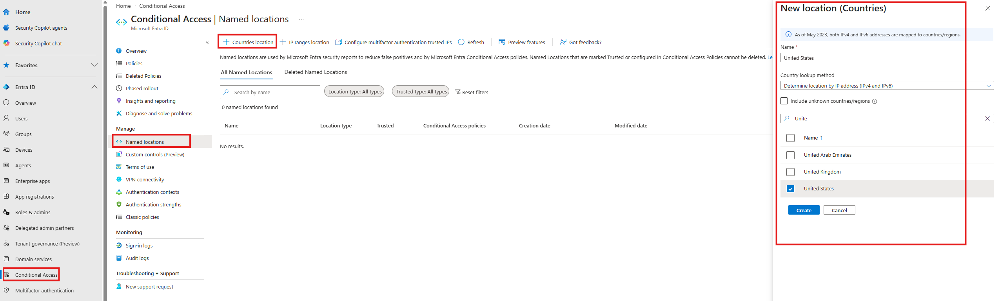

> **Note:** named locations can be country-based (like this one) or IP-range-based. IP-range locations can additionally be marked **Trusted**, which feeds the "All trusted networks and locations" option in policies and reduces false positives in Identity Protection risk detections.

## Step 2 - Create the Conditional Access policy

Navigate to **Entra ID > Conditional Access** and click **+ Create new policy**.

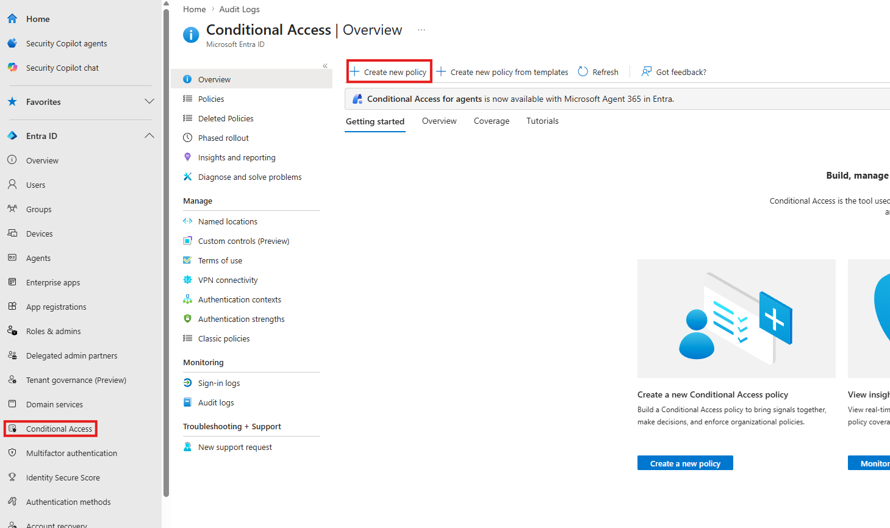

Name the policy `[Test] Require MFA - Untrusted Locations`. A clear naming convention (many teams prefix with `[Test]`, `CA01:`, etc.) pays off once you have dozens of policies.

Under **Assignments > Users or agents**, choose **Select users and groups** and add only the **Test User**. Scoping a new policy to a test user first is the same safety principle as report-only mode: it limits the blast radius.

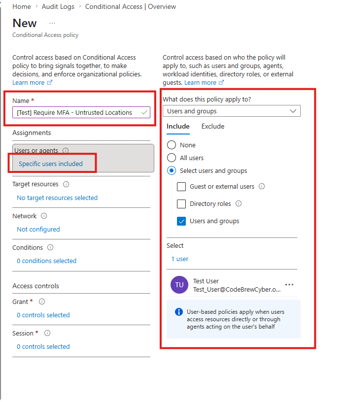

## Step 3 - Set the target resources

Under **Target resources**, select **All resources (formerly 'All cloud apps')**.

Note the "Don't lock yourself out!" warning the portal throws. This policy affects the Azure portal itself, which is exactly why we scoped to the test user and will use report-only mode.

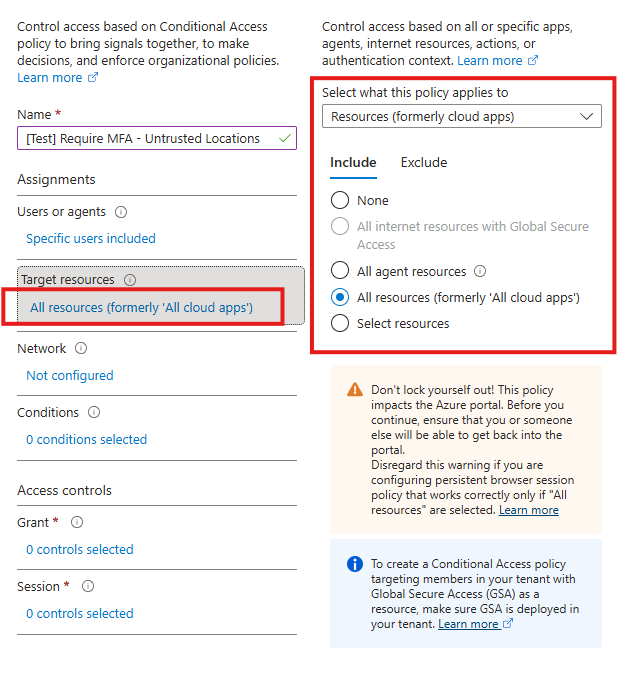

## Step 4 - Add the location condition

Under **Conditions > Locations**:

- **Configure:** Yes
- **Include:** Any network or location
- **Exclude:** Selected networks and locations, then pick the **United States** named location from Step 1

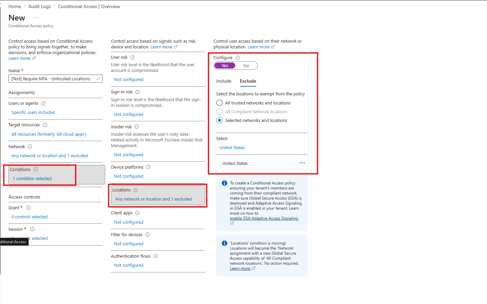

The logic reads: this policy applies to sign-ins from anywhere except the United States. Exclusions beat inclusions, a pattern worth remembering for the exam.

## Step 5 - Set the access control to Block

Under **Access controls > Grant**, select **Block access**.

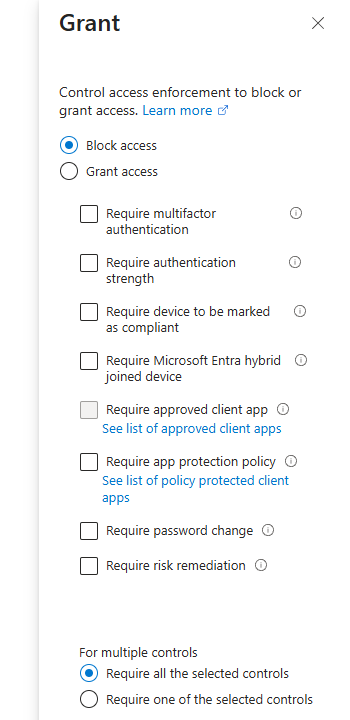

Combined with the condition above: any sign-in by the test user from outside the US would be blocked. Note the other options here (require MFA, compliant device, and so on). Block is the bluntest instrument, and most real policies grant with controls instead.

## Step 6 - Create the policy in Report-only mode

At the bottom, under **Enable policy**, make sure **Report-only** is selected, then click **Create**.

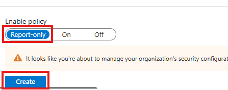

In report-only mode, every real sign-in evaluates this policy and records the result in the sign-in logs (under the Report-only tab of each sign-in event), but no one gets blocked. In production you'd let this bake for days or weeks and review the impact via **Insights and reporting** before flipping it On.

## Step 7 - Open the What If tool

Go to **Conditional Access > Policies**. Our policy shows with State "Report-only". Select **What if** in the toolbar.

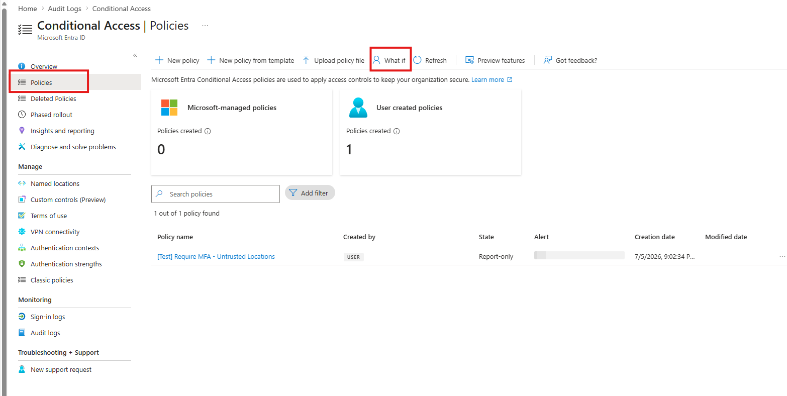

## Step 8 - Simulate a sign-in from the United States

What If needs an identity and enough sign-in context to evaluate. Configure:

- **Identity type:** Users, then select **Test User**
- **Target resource:** Cloud apps, then **Azure Virtual Desktop** (any app works since our policy targets all resources)
- **Device platform:** Windows
- **Client app:** Mobile apps and desktop clients - Modern authentication
- **IP address:** `8.8.8.8` (a well-known US address)
- **Country:** United States

Then click **What if** at the bottom.

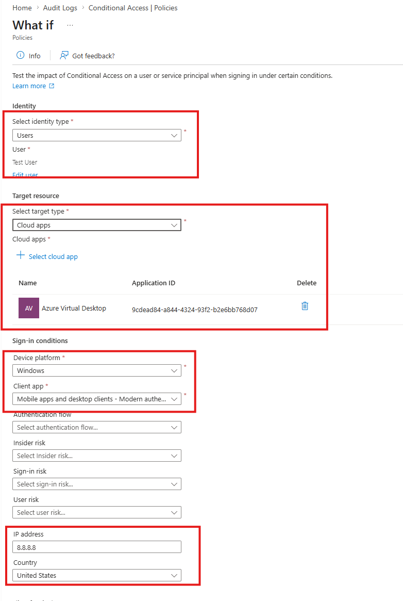

The evaluation result has two tabs. Under **Policies that will not apply**, there's our policy, with the reason listed as **Location**. The US sign-in matched our excluded location, so the policy doesn't touch it. Exactly as designed.

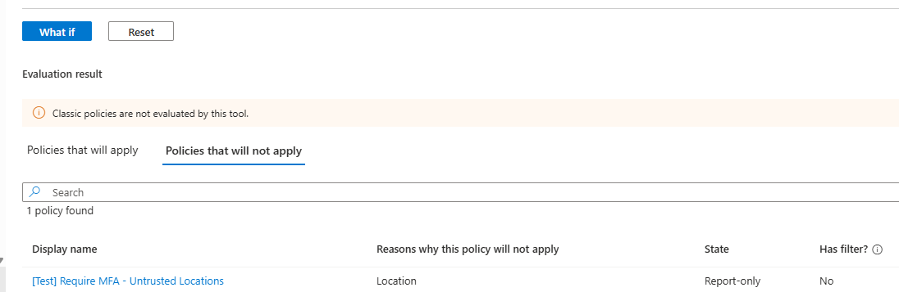

## Step 9 - Simulate a foreign sign-in

Change only the location fields (IP address `102.210.214.2`, Country: Spain) and run **What if** again.

Now the policy shows under **Policies that will apply**, with Grant control "Block access". If this policy were set to On, this sign-in would be blocked.

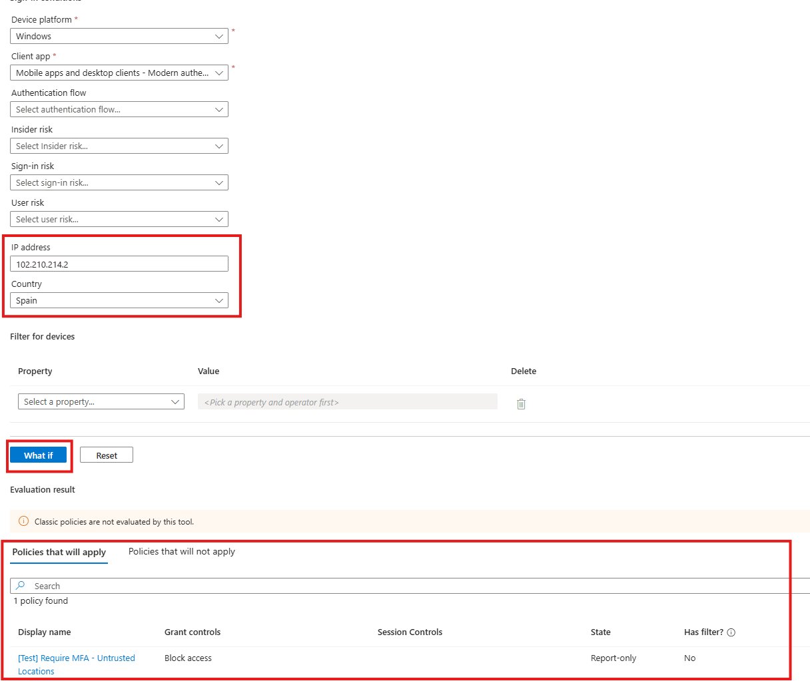

We've confirmed both branches of the policy logic without enforcing anything or touching a real sign-in.

## Cleanup

Delete the test policy (or leave it in report-only), and optionally the named location. Named locations referenced by a CA policy can't be deleted until the reference is removed.

## Key takeaways

- Report-only mode evaluates and logs but never enforces. It's the standard rollout path for any new CA policy.
- What If simulates policy evaluation for a hypothetical sign-in. The two result tabs ("will apply" / "will not apply", with reasons) tell you why a policy did or didn't match.
- Named locations are reusable building blocks. Country locations and trusted IP ranges serve different purposes.
- Scope new policies narrowly (test users first) and mind the portal's lockout warning. A misconfigured Block policy against All resources can lock admins out of Azure itself.
- Exclusions override inclusions in CA assignments and conditions.

## Related labs

- [PIM Eligible Role Activation with Approval]()
- [Entra ID App Registration + Admin Consent]()
