+++
title = "Custom RBAC Role + Azure Policy + Resource Lock"
date = 2026-07-06T14:45:00-04:00
draft = false
description = "Clone a custom RBAC role, deny deployments with Azure Policy, and block deletion with a resource lock: three governance layers in one lab."
tags = ["azure", "rbac", "azure-policy", "governance", "sc-500"]
categories = ["writeups"]
+++

Part of my SC-500 study series: hands-on labs in a test tenant, one concept at a time.

**Goal:** Touch all three Azure governance mechanisms in one sitting: a custom **RBAC role**, an **Azure Policy** assignment, and a **resource lock**. Each one answers a different question:

| Mechanism | Question it answers | Enforced when |
|---|---|---|
| RBAC role | Who can do what? | At the API call (authorization) |
| Azure Policy | What is allowed to exist / how must it be configured? | At creation/update (and audited after) |
| Resource lock | Can this thing be deleted or changed at all? | Always, regardless of RBAC role |

## Prerequisites

- An Azure subscription you can experiment in
- Owner or User Access Administrator rights (custom roles need role-write permission)
- A test resource group. This lab uses `SC-500_Test_Group` (create it fresh; we delete it at the end)

## Part 1 - Create a custom role by cloning Reader

Azure has hundreds of built-in roles, but sometimes none fits. A classic example: Reader is too generous because it can list storage account keys, which grants data-plane access. Instead of building a role from scratch, clone the closest built-in role and subtract.

### 1.1 Clone the Reader role

Go to **Subscription > Access control (IAM) > Roles**, find **Reader**, and choose to clone it. On the Basics tab:

- **Custom role name:** `Reader - No Storage Keys`
- **Baseline permissions:** Clone a role, with **Reader** as the role to clone

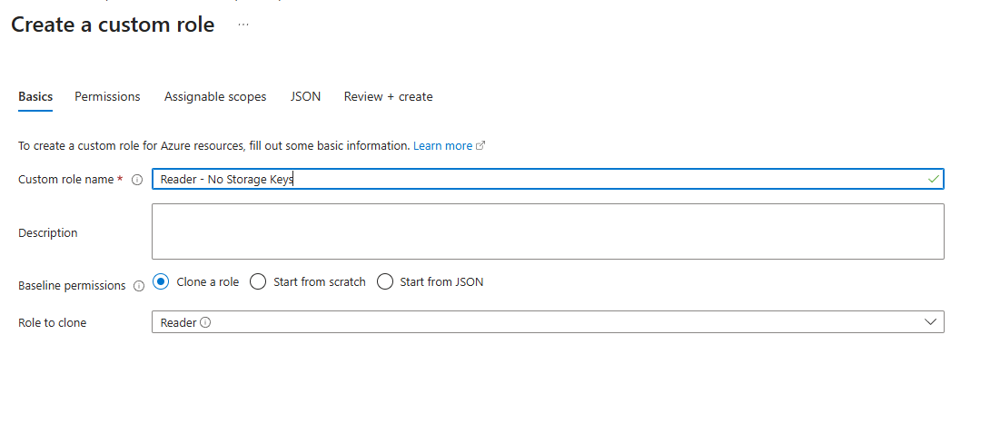

### 1.2 Exclude the listKeys permission

On the Permissions tab, choose **Exclude permissions**, browse to **Microsoft.Storage**, and search for `Microsoft.Storage/storageAccounts/listKeys/action`. Check **Other : List Storage Account Keys** as a **Not Action**.

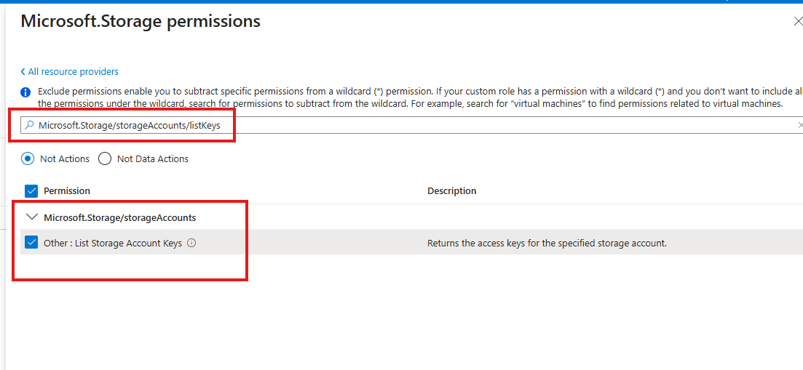

> **NotActions subtract, they don't deny.** Reader's permission set is `*/read` (a wildcard). `NotActions` carves exceptions out of that wildcard. It is not a deny rule: if the user gets `listKeys` from some other role assignment, this role does nothing to stop it. Explicit denies exist separately as deny assignments, which are created by Azure, not by you.

### 1.3 Set the assignable scope

On **Assignable scopes**, add the test resource group (`Azure subscription 1/SC-500_Test_Group`). Assignable scopes control where this role can be assigned. It's good hygiene for keeping experimental roles from spreading across the tenant.

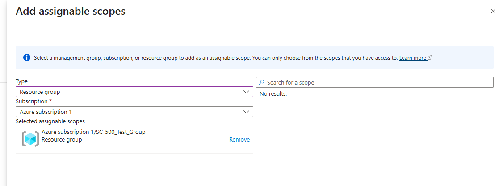

### 1.4 Review the JSON

The JSON tab shows what we actually built. Worth reading closely, because role JSON shows up on the exam:

```json
{
    "properties": {
        "roleName": "Reader - No Storage Keys",
        "description": "Test Custom Role",
        "assignableScopes": [
            "/subscriptions/<sub-id>/resourceGroups/SC-500_Test_Group"
        ],
        "permissions": [
            {
                "actions": [
                    "*/read"
                ],
                "notActions": [
                    "Microsoft.Storage/storageAccounts/listkeys/action"
                ],
                "dataActions": [],
                "notDataActions": []
            }
        ]
    }
}
```

Effective permissions = `actions` minus `notActions`: read everything, except listing storage keys. Note the separate `dataActions`/`notDataActions` arrays. Control-plane and data-plane permissions are distinct lists.

## Part 2 - Assign a built-in Azure Policy

Where RBAC governs people, Policy governs resources. We'll require a tag on everything created in the test resource group.

### 2.1 Find the definition

Go to **Policy > Authoring > Definitions** and search for `require a tag`. Select the built-in **Require a tag on resources** definition.

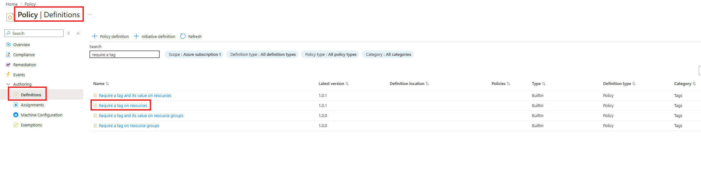

### 2.2 Assign it

Click **Assign**. On the Basics tab:

- **Scope:** `Azure subscription 1/SC-500_Test_Group`, so the policy applies only inside the test group
- **Policy definition:** Require a tag on resources
- **Policy enforcement:** Enabled

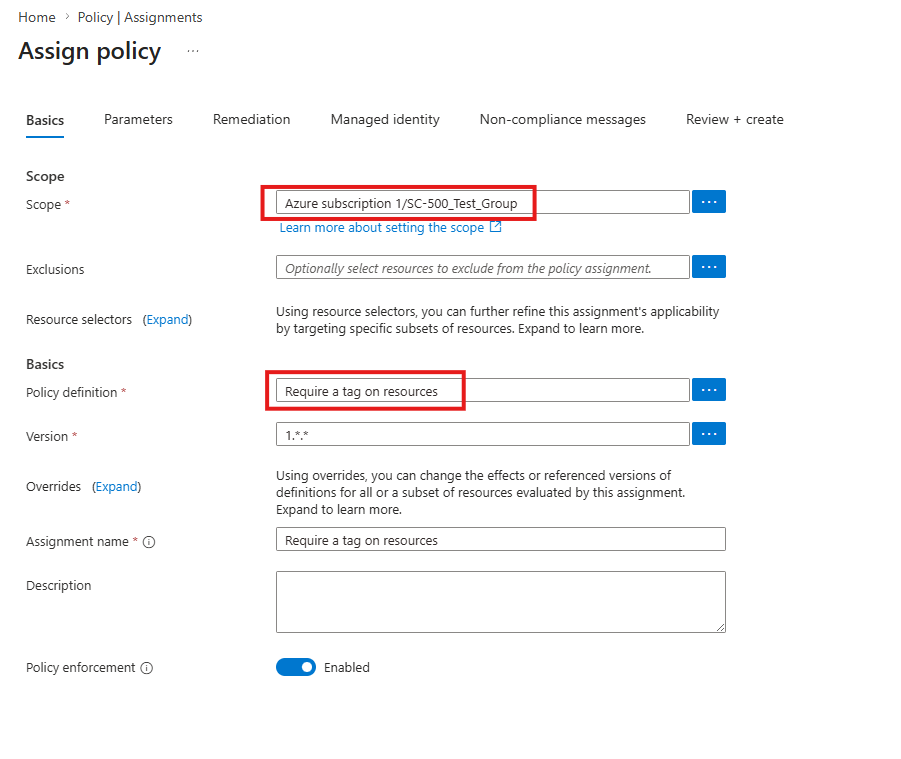

### 2.3 Set the parameter

On the **Parameters** tab, set **Tag Name** to `env`. Then **Review + create**, then **Create**.

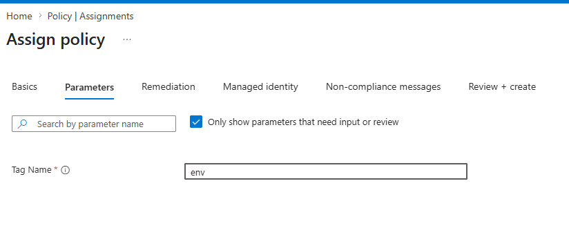

This definition uses the **deny** effect: any resource created (or updated) in scope without an `env` tag gets rejected at validation time. Other common effects to know: audit (allow but flag), append/modify (fix it for you), and deployIfNotExists (deploy companion resources).

### 2.4 Test the policy and watch it deny

Try to create a Storage account in `SC-500_Test_Group` (any name; here `testpolicy`, East US), filling in only the Basics tab.

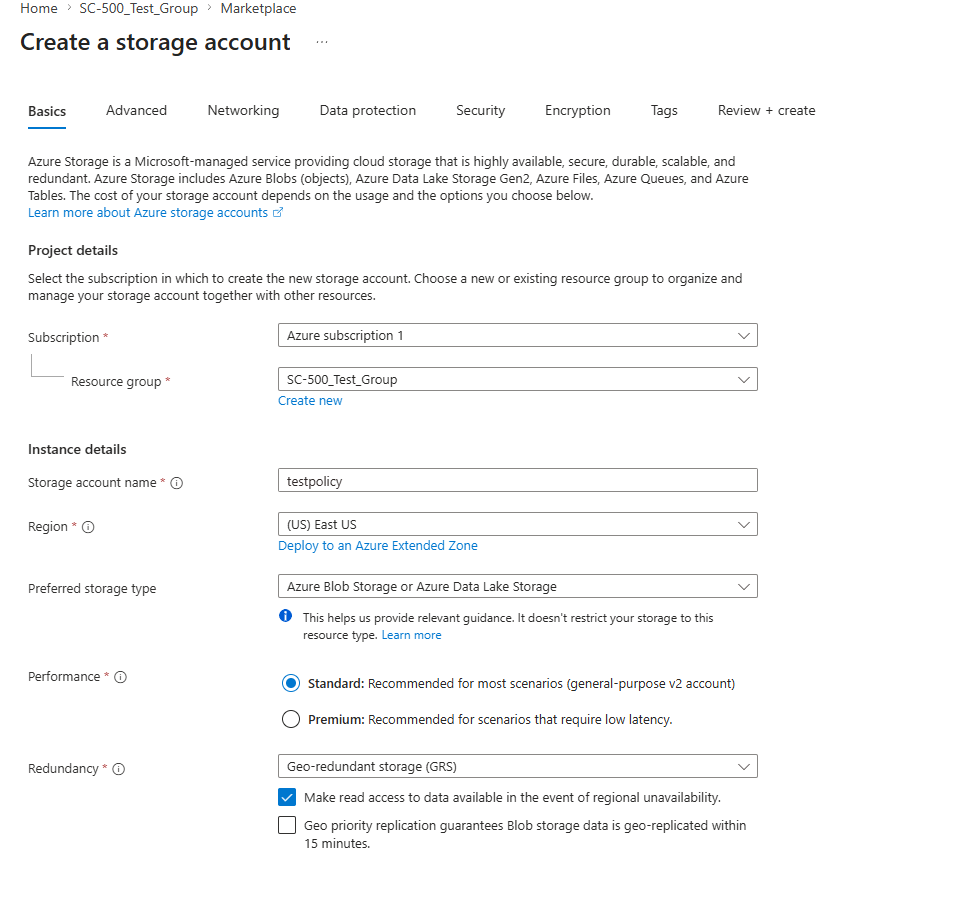

On **Review + create**, validation fails with a red banner and a red X on the **Tags** tab. The policy denied the deployment before anything was created.

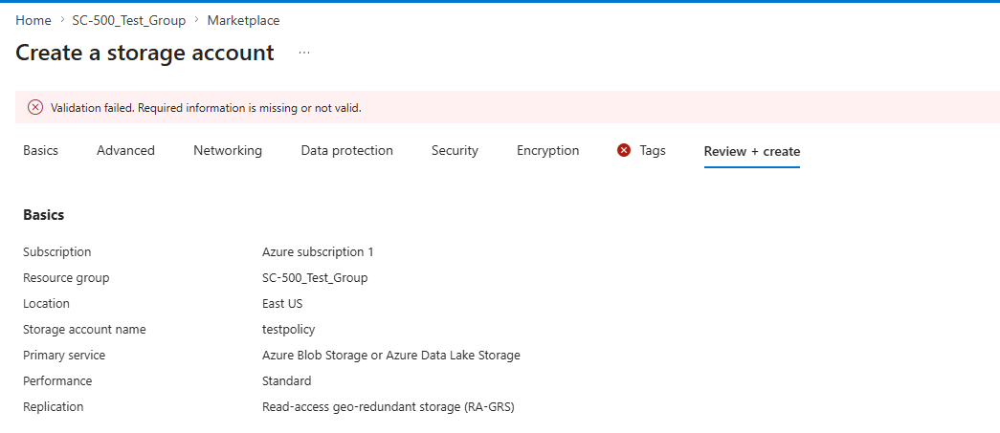

### 2.5 Satisfy the policy

Go back to the **Tags** tab and add a tag named `env`. The policy only requires that the tag exist, so any value works. That's the difference from the sibling definition "Require a tag **and its value** on resources".

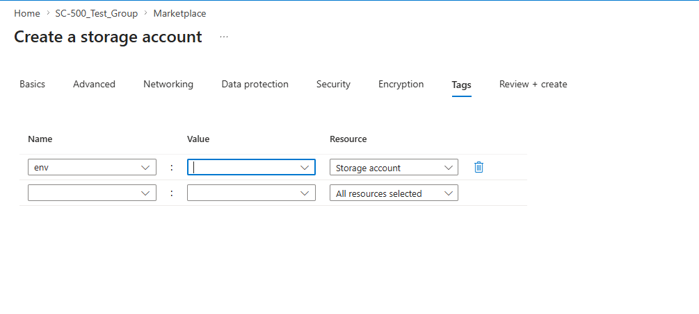

Validation now passes and the storage account deploys.

### 2.6 Check compliance

**Policy > Compliance** shows the assignment evaluating as **Compliant**. Every resource in scope satisfies the rule.

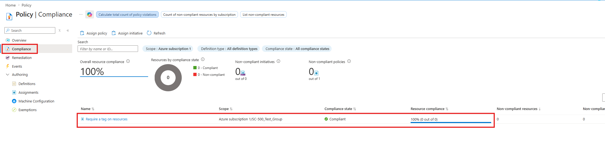

## Part 3 - Apply and test a resource lock

Locks are the last line of defense against accidental deletions, and they bind everyone, including Global Administrators and Owners.

### 3.1 Add the lock

In the resource group, go to **Settings > Locks** and click **+ Add**.

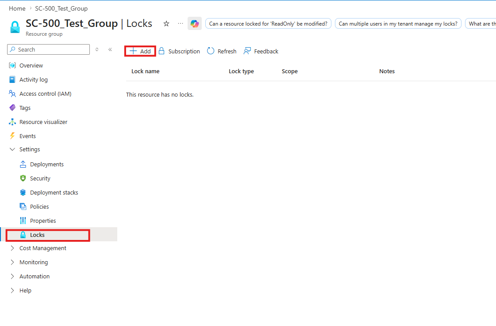

- **Lock name:** `CanNotDelete`
- **Lock type:** **Delete**. Reads and updates are still allowed; deletion is blocked. The other type, **Read-only**, blocks all changes and behaves like restricting everyone to the Reader role. It can break things in surprising ways; for example, listing storage keys is a POST and gets blocked.

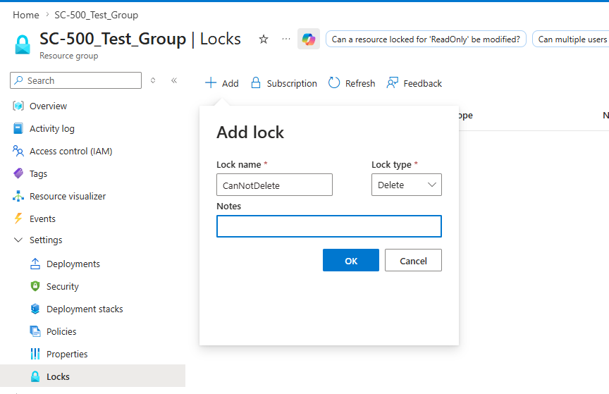

Locks inherit downward: a lock on the resource group protects every resource inside it.

### 3.2 Try to delete the resource group

From the resource group Overview, attempt **Delete resource group**. Even as Global Administrator, it fails:

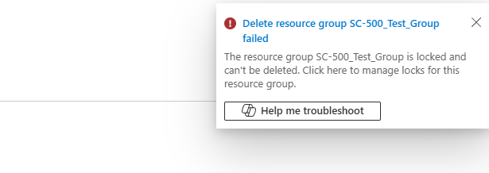

This is the key point: locks are not an RBAC concept. RBAC says you may delete; the lock says the delete operation itself is refused until the lock is removed. Removing a lock is its own permission (`Microsoft.Authorization/locks/*`, held by Owner and User Access Administrator), so a lock also acts as a deliberate two-step confirmation.

### 3.3 Remove the lock and clean up

Delete the lock from the **Locks** blade, then delete the resource group. This time it succeeds:

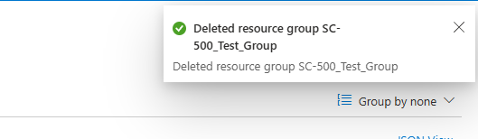

Deleting the resource group also cleans up the storage account and the policy assignment. Optionally delete the custom role too (**IAM > Roles**; it must have no active assignments).

## Key takeaways

- Custom roles are usually clone-and-subtract. `NotActions` subtracts from a wildcard; it is not an explicit deny. Effective permissions = Actions minus NotActions.
- Assignable scopes limit where a custom role can even be assigned. Use them to contain experiments.
- Azure Policy governs resources, not people. The deny effect rejects non-compliant deployments at validation time, and the Compliance blade gives you the ongoing audit view.
- Parameters make policy definitions reusable: one built-in definition, any tag name.
- Resource locks override RBAC. A Delete lock stops even a Global Administrator, and locks inherit from parent scopes. Know Delete vs Read-only for the exam.
- Together they layer: RBAC decides who can act, Policy decides what may exist, locks decide what must survive.

## Related labs

- [Entra ID App Registration + Admin Consent]()
- [PIM Eligible Role Activation with Approval]()
- [Hub-Spoke Topology with VNet Peering]()
