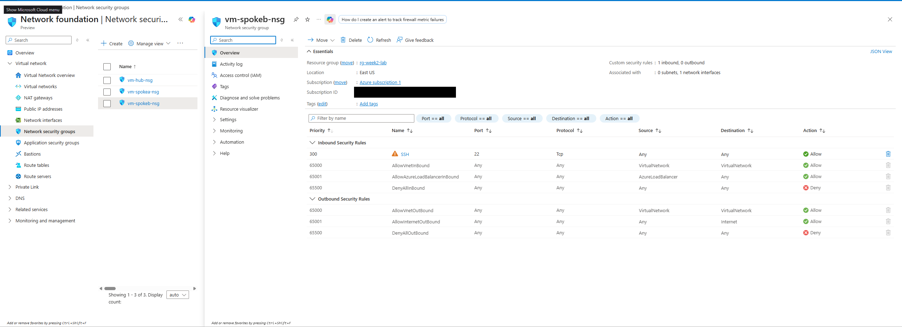
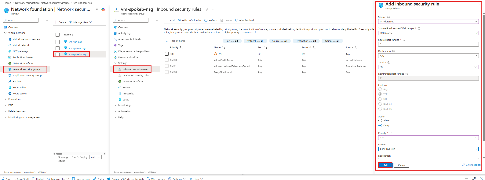
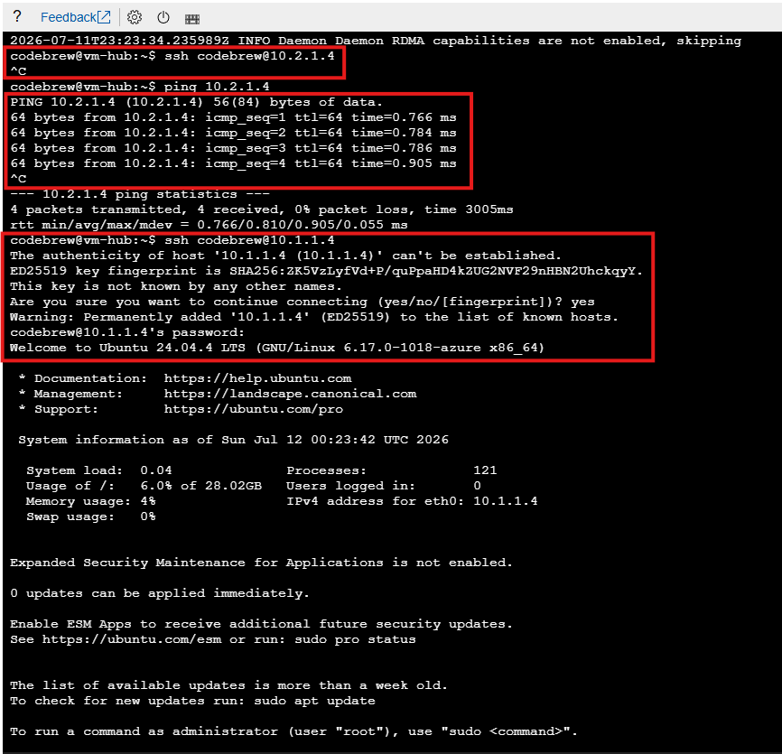
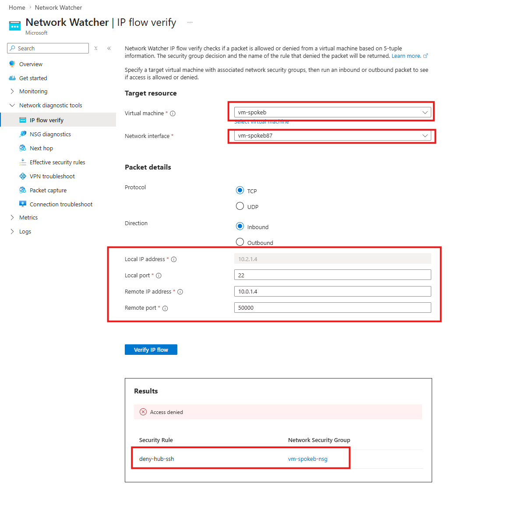
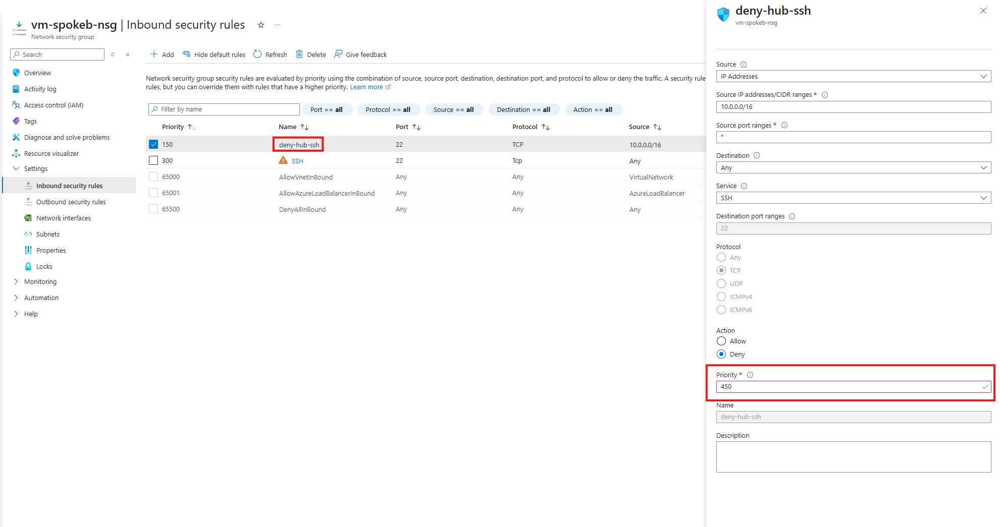
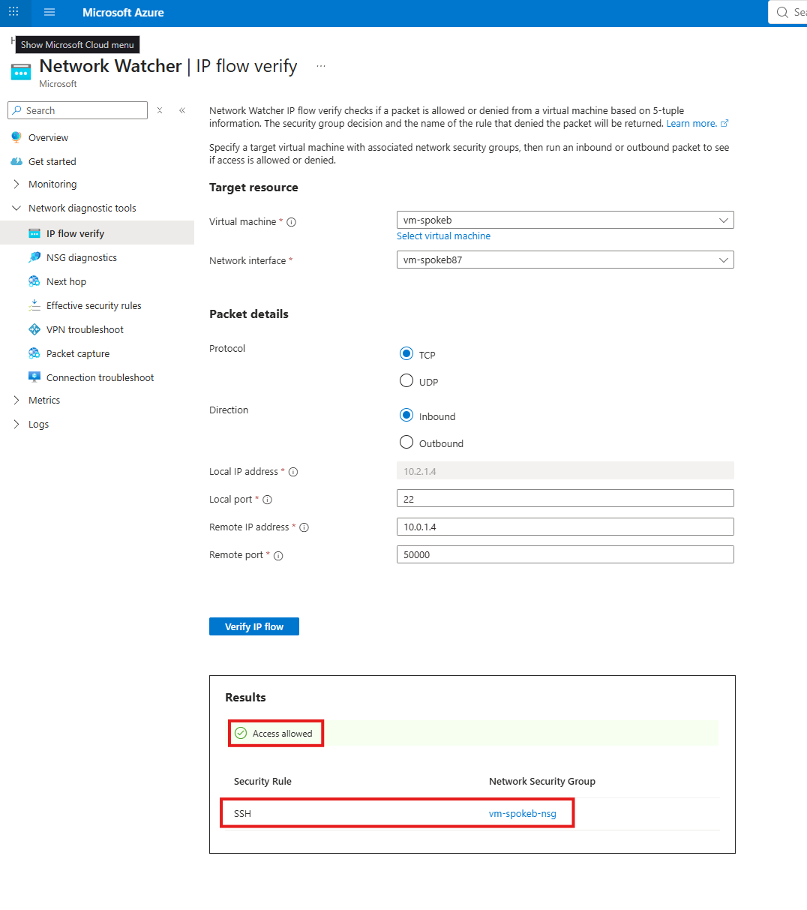
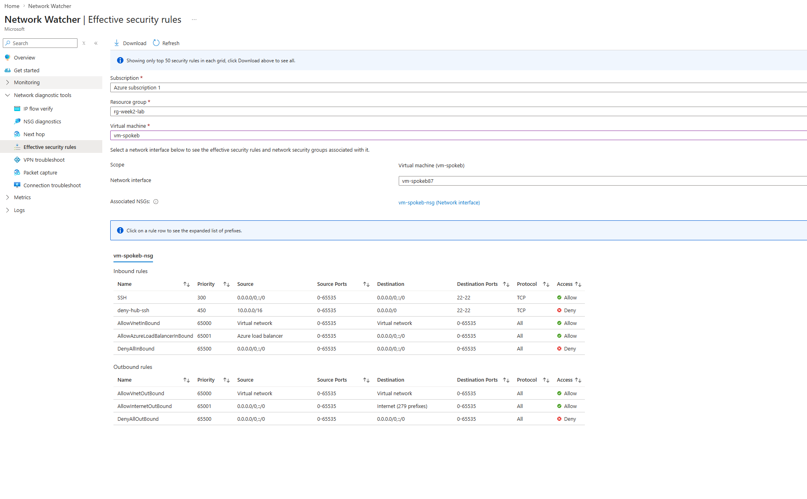
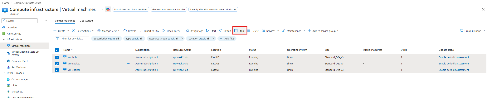
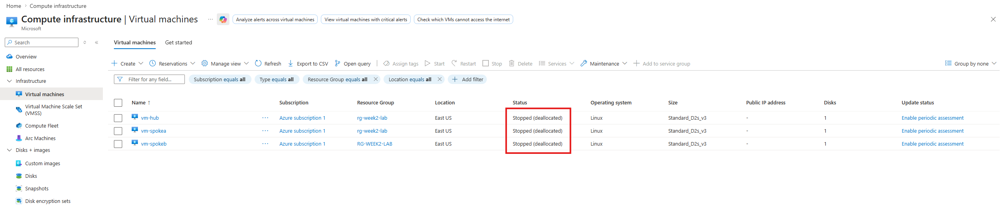

+++
title = "NSG Priority Ordering + Network Watcher Verification"
date = 2026-07-11T22:00:00-04:00
draft = false
description = "Flip NSG rule priorities and watch the outcome reverse, verified with IP flow verify and effective security rules."
tags = ["azure", "networking", "nsg", "network-watcher", "sc-500"]
categories = ["writeups"]
+++

Part of my SC-500 study series: hands-on labs in a test tenant, one concept at a time.

**Goal:** Watch NSG priority ordering decide a packet's fate. Build a deny rule that beats an allow rule, flip their order, and watch the outcome reverse, verifying each state with the two Network Watcher tools the SC-500 objectives name verbatim: **IP flow verify** and **Effective security rules**.

> **Prerequisite environment:** this lab reuses the infrastructure from [Hub-Spoke Topology with VNet Peering](): resource group `rg-week2-lab` with `vnet-hub` (10.0.0.0/16), `vnet-spoke-a` (10.1.0.0/16), `vnet-spoke-b` (10.2.0.0/16), peered hub to spoke, and a Linux VM in each. Start the VMs back up if you deallocated them.

## Why this matters

NSG evaluation follows three rules, and the exam tests them constantly:

1. Rules are processed in priority order, lowest number first.
2. The first match wins. Processing stops immediately and nothing later can override it.
3. If no custom rule matches, the default 65000-series rules decide (allow VNet, allow load balancer, deny all inbound).

"Lowest number = highest priority" plus "first match wins" answers almost every NSG question you'll see. The rest of this lab is about proving your rule set does what you think it does, which in real troubleshooting means Network Watcher rather than squinting at the portal.

## Step 1 - Confirm the NSG on spoke-b's VM

Creating the VMs with SSH access gave each one an NSG attached to its NIC. (NSGs can associate to a subnet, a NIC, or both; effective rules are the intersection.) Open `vm-spokeb-nsg` under **Network security groups** and read its inbound rules:

- **300 / SSH / TCP 22 / Any -> Allow**, added by VM creation
- **65000 AllowVnetInBound**, **65001 AllowAzureLoadBalancerInBound**, **65500 DenyAllInBound**: the immutable defaults

Because of rule 300 plus 65000 (VNet-to-VNet traffic is allowed by default), the hub VM can currently SSH to spoke-b freely.

## Step 2 - Add a deny rule at priority 150

Add an inbound rule to `vm-spokeb-nsg` that blocks SSH specifically from the hub:

- **Source:** IP Addresses, `10.0.0.0/16` (the hub VNet's address space)
- **Source port ranges:** `*`
- **Destination:** Any. **Service:** SSH (TCP 22)
- **Action:** Deny
- **Priority:** 150
- **Name:** `deny-hub-ssh`

Priority 150 sits in front of the allow at 300, so for SSH-from-hub packets the deny is matched first and evaluation stops.

## Step 3 - Test from the hub VM

From `vm-hub`'s serial console:

- `ssh` to spoke-b (10.2.1.4): hangs. The deny rule silently drops the TCP handshake.
- `ping 10.2.1.4`: works. Our rule denies only TCP 22; ICMP still rides the VNet-allow default.
- `ssh` to spoke-a (10.1.1.4): connects and logs in. Spoke-a's NSG has no such deny rule, so the blast radius is exactly the one rule we wrote.

## Step 4 - Ask Azure why: IP flow verify

A hanging SSH tells you that something blocked it, not what. **Network Watcher > IP flow verify** answers the second question. Configure:

- **Virtual machine:** `vm-spokeb`, and its NIC
- **Protocol:** TCP. **Direction:** Inbound
- **Local (destination) IP/port:** `10.2.1.4` : `22`
- **Remote (source) IP/port:** `10.0.1.4` (the hub VM) : any ephemeral port, e.g. `50000`

Result: **Access denied**, and, the useful part, it names the decision-maker: security rule `deny-hub-ssh` in `vm-spokeb-nsg`.

This is the standard troubleshooting flow the exam asks about: a VM can't reach another VM, which tool identifies the NSG rule responsible? IP flow verify.

## Step 5 - Flip the order, flip the outcome

Now confirm that only priority decides. Open `deny-hub-ssh` and change its priority from 150 to **450**, behind the existing allow rule at 300. No other change.

Re-run the exact same IP flow verify: **Access allowed**, decided by the SSH allow rule (priority 300). Same packet, same rules. Only the ordering changed, and the first match is now an allow.

## Step 6 - Read the merged rule set: Effective security rules

**Network Watcher > Effective security rules** (target: `vm-spokeb` and its NIC) shows the full merged picture the platform actually enforces: custom rules and the 65000-series defaults, inbound and outbound, across every associated NSG.

Reading this table top to bottom is the NSG algorithm: SSH allow at 300, our deny now at 450 (too late to matter), then the defaults. If a subnet NSG existed too, it would appear here as well. This blade is where you debug subnet-vs-NIC rule interactions.

## Step 7 - Deallocate the VMs

Stop compute billing until the next lab: select all three VMs and **Stop** them from the portal (or `az vm deallocate`).

Confirm the status reads **Stopped (deallocated)**. A plain "Stopped" from inside the guest OS still bills for compute; deallocated releases the hardware.

> **Disks keep billing.** Deallocating stops compute charges, but the managed disks attached to the VMs bill for storage regardless of VM state. Delete the whole resource group when you're finished with the lab series.

## Key takeaways

- Lowest priority number wins, and the first match stops evaluation. The whole lab is those two facts, observed from both sides of a priority flip.
- Deny rules are precise: our TCP/22 deny left ICMP and every other flow untouched.
- IP flow verify answers "would this 5-tuple be allowed, and which rule decides?" It's the go-to for connectivity triage.
- Effective security rules shows the merged, platform-enforced rule set (custom + defaults, NIC + subnet NSGs) on a NIC.
- Default rules to memorize: 65000 AllowVnetInBound, 65001 AllowAzureLoadBalancerInBound, 65500 DenyAllInBound (and the outbound trio).
- Stopped and deallocated are different states for billing, and disks bill either way.

## Related labs

- [Hub-Spoke Topology with VNet Peering]() is the environment this lab runs in
- [Conditional Access in Report-Only Mode + What If]() applies the same "simulate before you enforce" idea to identity
